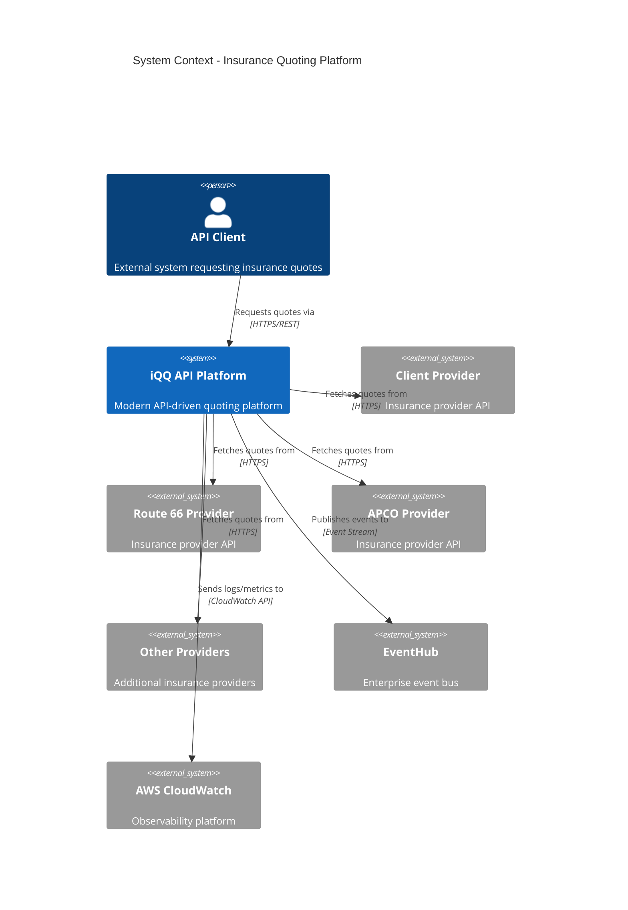
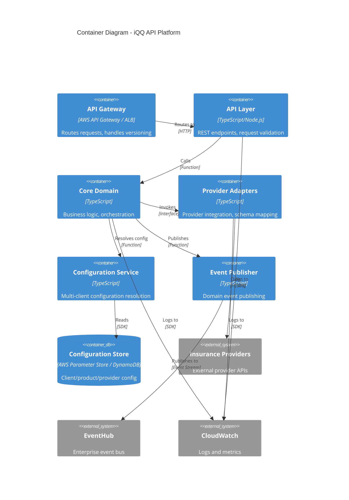
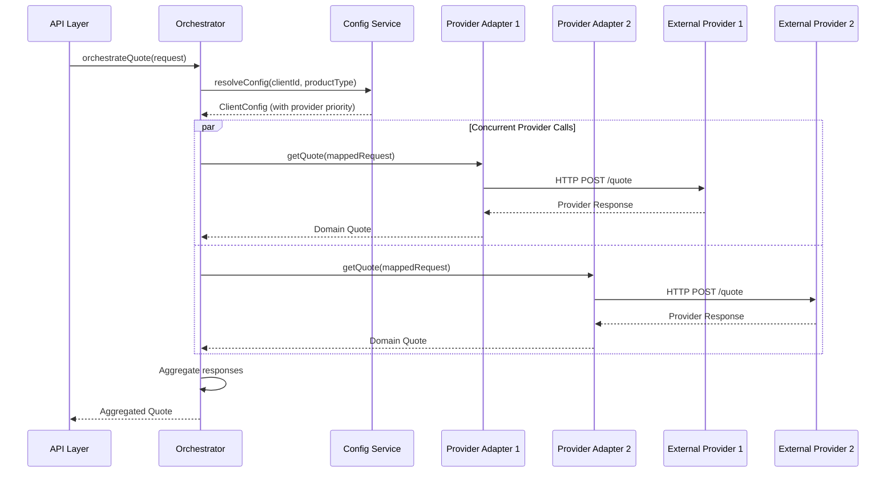

# Design Document: API Modernization Reference Architecture

## Overview

This design document specifies a modern, API-driven reference architecture for Client Solutions' Insurance Quoting Platform (iQQ). The architecture demonstrates patterns for multi-provider integration, API versioning, multi-client configuration, and request orchestration while maintaining clean separation of concerns and preventing domain leakage.

The reference architecture is code-based with working stubs, mocks, and placeholders—intended for architectural clarity and Office of Architecture review, not production deployment.

### Key Design Principles

1. **Domain-Driven Design**: Core domain models remain independent of external provider schemas
2. **Hexagonal Architecture**: Clear boundaries between API layer, domain logic, and external adapters
3. **Configuration-Driven Behavior**: Client, product, and provider behaviors externalized from code
4. **Fail-Safe Orchestration**: Graceful degradation with provider fallback and partial failure handling
5. **Observable by Default**: Structured logging, metrics, and distributed tracing throughout
6. **API Evolution**: Modern versioning supporting multiple concurrent versions without duplication

## Architecture

### System Context



### Container Architecture



### Component Architecture

The architecture follows a layered hexagonal pattern with clear boundaries:

```
┌─────────────────────────────────────────────────────────────┐
│                        API Layer                             │
│  - REST Controllers (v1, v2, ...)                           │
│  - Request/Response DTOs                                     │
│  - Validation                                                │
│  - Version Routing                                           │
└─────────────────────────────────────────────────────────────┘
                            │
                            ▼
┌─────────────────────────────────────────────────────────────┐
│                      Core Domain                             │
│  - Domain Models (Quote, Product, Coverage)                 │
│  - Orchestration Service                                     │
│  - Business Rules                                            │
│  - Port Interfaces (IProviderAdapter, IConfigService)       │
└─────────────────────────────────────────────────────────────┘
                            │
                ┌───────────┴───────────┐
                ▼                       ▼
┌──────────────────────────┐  ┌──────────────────────────┐
│   Provider Adapters      │  │  Configuration Service   │
│  - ClientAdapter         │  │  - Config Resolution     │
│  - Route66Adapter        │  │  - Client/Product Rules  │
│  - APCOAdapter           │  │  - Provider Routing      │
│  - Schema Mapping        │  │  - Fallback Logic        │
└──────────────────────────┘  └──────────────────────────┘
```

## Components and Interfaces

### 1. API Layer

**Responsibility**: External-facing REST API with versioning support

**Key Components**:

- **Version Router**: Routes requests to appropriate version handler based on header or path
- **Controllers**: Handle HTTP concerns (validation, serialization, error mapping)
- **DTOs**: Version-specific data transfer objects

**Interfaces**:

```typescript
// API Layer exposes versioned endpoints
interface QuoteController {
  requestQuote(request: QuoteRequestDTO): Promise<QuoteResponseDTO>;
  getQuoteStatus(quoteId: string): Promise<QuoteStatusDTO>;
}

// Version mapping translates between API versions
interface VersionMapper {
  mapRequestToV2(v1Request: V1QuoteRequestDTO): V2QuoteRequestDTO;
  mapResponseToV1(v2Response: V2QuoteResponseDTO): V1QuoteResponseDTO;
}
```

**Versioning Strategy**:

- **Header-based versioning**: `Accept: application/vnd.iqq.v2+json`
- **Path-based versioning** (alternative): `/v2/quotes`
- **Version mapping layer**: Translates between versions to minimize duplication
- **Contract tests**: Validate backward compatibility

### 2. Core Domain

**Responsibility**: Business logic, orchestration, domain models

**Key Components**:

- **Domain Models**: Canonical representations (Quote, Product, Coverage, Client)
- **Orchestration Service**: Decomposes requests, coordinates provider calls, aggregates responses
- **Business Rules**: Validation, pricing logic, eligibility checks

**Interfaces**:

```typescript
// Core domain models
interface Quote {
  id: string;
  clientId: string;
  products: Product[];
  totalPremium: Money;
  status: QuoteStatus;
  correlationId: string;
}

interface Product {
  productType: ProductType;
  coverages: Coverage[];
  premium: Money;
  providerId: string;
}

// Orchestration service
interface IQuoteOrchestrator {
  orchestrateQuote(request: QuoteRequest, config: ClientConfig): Promise<Quote>;
}

// Port for provider integration
interface IProviderAdapter {
  getQuote(request: ProviderQuoteRequest): Promise<ProviderQuoteResponse>;
  getProviderName(): string;
  supportsProduct(productType: ProductType): boolean;
}

// Port for configuration
interface IConfigService {
  resolveConfig(clientId: string, productType: ProductType): Promise<ClientConfig>;
}

interface ClientConfig {
  clientId: string;
  productType: ProductType;
  providerPriority: string[]; // Ordered list for fallback
  defaults: Record<string, any>;
  routingRules: RoutingRule[];
}
```

**Orchestration Flow**:



### 3. Provider Adapters

**Responsibility**: Integrate with external providers, prevent domain leakage

**Key Components**:

- **Adapter Implementations**: One per provider (ClientAdapter, Route66Adapter, APCOAdapter)
- **Schema Mappers**: Bidirectional mapping between domain and provider models
- **Circuit Breaker**: Fail-fast pattern for provider failures
- **Retry Logic**: Configurable retry with exponential backoff

**Implementation Pattern**:

```typescript
// Provider adapter implementation
class ClientProviderAdapter implements IProviderAdapter {
  constructor(
    private httpClient: HttpClient,
    private mapper: ClientSchemaMapper,
    private logger: Logger,
    private circuitBreaker: CircuitBreaker
  ) {}

  async getQuote(request: ProviderQuoteRequest): Promise<ProviderQuoteResponse> {
    const correlationId = request.correlationId;
    
    try {
      // Map domain request to provider schema
      const providerRequest = this.mapper.toProviderSchema(request);
      
      this.logger.info('Calling Client provider', { correlationId, providerId: 'client' });
      
      // Call provider with circuit breaker
      const providerResponse = await this.circuitBreaker.execute(() =>
        this.httpClient.post('/api/quote', providerRequest)
      );
      
      // Map provider response to domain model
      const domainResponse = this.mapper.toDomainModel(providerResponse);
      
      this.logger.info('Client provider response received', { 
        correlationId, 
        providerId: 'client',
        premium: domainResponse.premium 
      });
      
      return domainResponse;
      
    } catch (error) {
      this.logger.error('Client provider call failed', { 
        correlationId, 
        providerId: 'client',
        error: error.message 
      });
      throw new ProviderError('client', error);
    }
  }

  getProviderName(): string {
    return 'client';
  }

  supportsProduct(productType: ProductType): boolean {
    return ['auto', 'home', 'umbrella'].includes(productType);
  }
}

// Schema mapper prevents domain leakage
class ClientSchemaMapper {
  toProviderSchema(domain: ProviderQuoteRequest): ClientQuoteRequest {
    return {
      // Map domain fields to Client provider schema
      quote_id: domain.quoteId,
      customer_info: {
        first_name: domain.customer.firstName,
        last_name: domain.customer.lastName,
        // ... provider-specific fields
      },
      // ... rest of mapping
    };
  }

  toDomainModel(provider: ClientQuoteResponse): ProviderQuoteResponse {
    return {
      // Map Client provider schema to domain model
      quoteId: provider.quote_id,
      premium: new Money(provider.total_premium, 'USD'),
      coverages: provider.coverages.map(c => this.mapCoverage(c)),
      // ... rest of mapping
    };
  }
}
```

### 4. Configuration Service

**Responsibility**: Resolve multi-client configuration

**Key Components**:

- **Config Resolver**: Determines applicable configuration based on client/product/provider
- **Config Store**: Externalized configuration (DynamoDB, Parameter Store, or JSON files for reference)
- **Caching Layer**: Reduces config lookup latency

**Configuration Schema**:

```typescript
interface ClientConfig {
  clientId: string;
  productType: ProductType;
  providerPriority: string[]; // ['client', 'route66', 'apco']
  defaults: {
    deductible?: number;
    coverageLimit?: number;
    // ... product-specific defaults
  };
  routingRules: RoutingRule[];
  fallbackBehavior: 'fail-fast' | 'best-effort' | 'all-or-nothing';
}

interface RoutingRule {
  condition: string; // e.g., "state === 'CA'"
  providerOverride: string[];
}
```

**Configuration Resolution**:

```typescript
class ConfigService implements IConfigService {
  async resolveConfig(clientId: string, productType: ProductType): Promise<ClientConfig> {
    // 1. Check cache
    const cached = await this.cache.get(`config:${clientId}:${productType}`);
    if (cached) return cached;
    
    // 2. Load from store
    const config = await this.configStore.getConfig(clientId, productType);
    
    // 3. Apply defaults if not found
    const resolved = config || this.getDefaultConfig(productType);
    
    // 4. Cache and return
    await this.cache.set(`config:${clientId}:${productType}`, resolved, 300);
    return resolved;
  }
}
```

### 5. Event Publisher

**Responsibility**: Publish domain events to EventHub

**Key Events**:

- `QuoteRequested`: When a quote request is received
- `QuoteCompleted`: When orchestration completes successfully
- `QuoteFailed`: When orchestration fails
- `ProviderCallCompleted`: When individual provider calls complete

**Event Schema**:

```typescript
interface DomainEvent {
  eventId: string;
  eventType: string;
  correlationId: string;
  timestamp: Date;
  payload: any;
}

interface QuoteCompletedEvent extends DomainEvent {
  eventType: 'QuoteCompleted';
  payload: {
    quoteId: string;
    clientId: string;
    productTypes: string[];
    totalPremium: number;
    providersUsed: string[];
  };
}
```

## Data Models

### Domain Models

**Quote Aggregate**:

```typescript
class Quote {
  constructor(
    public readonly id: string,
    public readonly clientId: string,
    public readonly correlationId: string,
    public readonly products: Product[],
    public readonly status: QuoteStatus,
    public readonly createdAt: Date,
    public readonly updatedAt: Date
  ) {}

  get totalPremium(): Money {
    return this.products.reduce(
      (sum, p) => sum.add(p.premium),
      Money.zero('USD')
    );
  }

  isComplete(): boolean {
    return this.status === QuoteStatus.COMPLETED;
  }
}

class Product {
  constructor(
    public readonly productType: ProductType,
    public readonly providerId: string,
    public readonly coverages: Coverage[],
    public readonly premium: Money,
    public readonly metadata: Record<string, any>
  ) {}
}

class Coverage {
  constructor(
    public readonly type: CoverageType,
    public readonly limit: Money,
    public readonly deductible: Money,
    public readonly premium: Money
  ) {}
}

enum QuoteStatus {
  PENDING = 'PENDING',
  IN_PROGRESS = 'IN_PROGRESS',
  COMPLETED = 'COMPLETED',
  FAILED = 'FAILED',
  PARTIAL = 'PARTIAL'
}

enum ProductType {
  AUTO = 'AUTO',
  HOME = 'HOME',
  UMBRELLA = 'UMBRELLA',
  LIFE = 'LIFE'
}
```

### API DTOs (Version 2)

```typescript
interface V2QuoteRequestDTO {
  clientId: string;
  products: V2ProductRequestDTO[];
  customer: V2CustomerDTO;
  effectiveDate: string; // ISO 8601
}

interface V2ProductRequestDTO {
  productType: string;
  coverages: V2CoverageRequestDTO[];
}

interface V2QuoteResponseDTO {
  quoteId: string;
  status: string;
  products: V2ProductResponseDTO[];
  totalPremium: number;
  currency: string;
  expiresAt: string;
}
```

### Provider Schemas (Example: Client Provider)

```typescript
// This stays in the adapter layer only
interface ClientQuoteRequest {
  quote_id: string;
  customer_info: {
    first_name: string;
    last_name: string;
    date_of_birth: string;
  };
  coverage_details: {
    product_code: string;
    limits: number[];
  };
}

interface ClientQuoteResponse {
  quote_id: string;
  total_premium: number;
  coverages: ClientCoverage[];
  status_code: string;
}
```

## Data Models


### Configuration Data Model

```typescript
interface ConfigurationStore {
  clients: Map<string, ClientConfiguration>;
  products: Map<string, ProductConfiguration>;
  providers: Map<string, ProviderConfiguration>;
}

interface ClientConfiguration {
  clientId: string;
  name: string;
  productConfigs: Map<ProductType, ClientProductConfig>;
}

interface ClientProductConfig {
  productType: ProductType;
  providerPriority: string[];
  defaults: Record<string, any>;
  routingRules: RoutingRule[];
  fallbackBehavior: FallbackBehavior;
}

interface ProviderConfiguration {
  providerId: string;
  name: string;
  baseUrl: string;
  timeout: number;
  retryConfig: RetryConfig;
  circuitBreakerConfig: CircuitBreakerConfig;
  supportedProducts: ProductType[];
}
```

