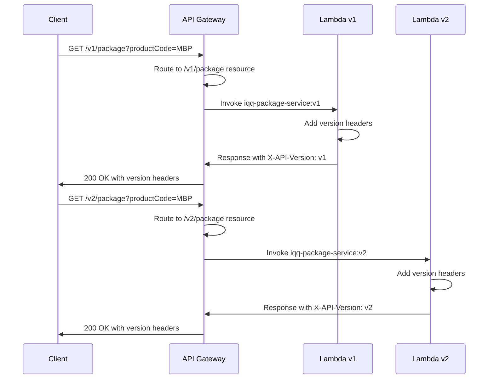
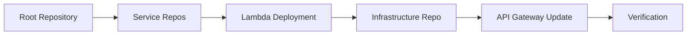
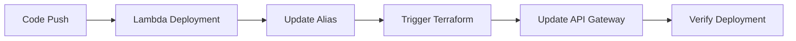

# API Versioning Design Document

## Overview

This design document details the implementation of URL path-based API versioning for the iQQ Insurance Quoting Platform. The solution enables multiple API versions to coexist, allowing clients to migrate at their own pace while maintaining backward compatibility.

### Design Goals

1. **Backward Compatibility**: Existing clients continue working without changes
2. **Gradual Migration**: Clients can migrate from v1 to v2 on their timeline
3. **Clear Versioning**: Version is explicit in the URL path
4. **Minimal Complexity**: Leverage existing Lambda aliases and stage variables
5. **Monitoring**: Track usage per version for migration planning

### Key Design Decisions

**Decision 1: URL Path Versioning**
- **Rationale**: Most explicit, industry standard (Stripe, Twilio, AWS), works with all HTTP clients
- **Alternative Considered**: Header-based versioning (rejected due to visibility and testing concerns)

**Decision 2: Version in Path, Not Stage**
- **Current**: `/dev/package` with stage variable `lambdaAlias=v1`
- **Proposed**: `/v1/package` with stage variable `lambdaAlias=v1`
- **Rationale**: Decouples API version from deployment environment

**Decision 3: Maximum 2 Concurrent Versions**
- **Rationale**: Limits maintenance burden, forces timely migrations
- **Policy**: Current stable (v2) + previous deprecated (v1) only

## Architecture

### Current Architecture

```
API Gateway: iqq-api-dev
└── Stage: dev (lambdaAlias=v1 via stage variable)
    ├── /package  → iqq-package-service:${stageVariables.lambdaAlias}
    ├── /lender   → iqq-lender-service:${stageVariables.lambdaAlias}
    ├── /product  → iqq-product-service:${stageVariables.lambdaAlias}
    └── /document → iqq-document-service:${stageVariables.lambdaAlias}
```

**Current URLs**: `https://[api-id].execute-api.us-east-1.amazonaws.com/dev/package`

**Issues with Current Architecture**:
- Version is tied to stage variable (`lambdaAlias=v1`)
- Cannot run multiple versions simultaneously
- Clients cannot choose their version
- Breaking changes would force all clients to migrate immediately
- Stage variable adds indirection
- Stage name (`dev`) doesn't represent environment (since there's only one)

### Proposed Architecture

**Simplified Stage-Based Versioning**: Since you don't have separate dev/prod environments, we can use API Gateway stages to represent versions directly.

```
API Gateway: iqq-api
├── Stage: v1
│   ├── /package  → iqq-package-service:v1 (Lambda alias)
│   ├── /lender   → iqq-lender-service:v1
│   ├── /product  → iqq-product-service:v1
│   └── /document → iqq-document-service:v1
└── Stage: v2
    ├── /package  → iqq-package-service:v2 (Lambda alias)
    ├── /lender   → iqq-lender-service:v2
    ├── /product  → iqq-product-service:v2
    └── /document → iqq-document-service:v2
```

**Resulting URLs**:
- v1: `https://[api-id].execute-api.us-east-1.amazonaws.com/v1/package`
- v2: `https://[api-id].execute-api.us-east-1.amazonaws.com/v2/package`

**With Custom Domain** (optional):
- v1: `https://api.iqq.com/v1/package`
- v2: `https://api.iqq.com/v2/package`

**Key Points**:
- **Stages = Versions**: `v1` and `v2` stages represent API versions
- **Same Resources**: Both stages have the same resource structure (/package, /lender, etc.)
- **Stage Variables**: Can use stage variables to route to correct Lambda alias
- **Simpler**: No nested paths (/v1/v1/package), cleaner URLs
- **Perfect for Single Environment**: Since you don't need dev/prod separation

**Benefits of Stage-Based Versioning (in your case)**:
- ✅ Cleaner URLs (no double version in path)
- ✅ Native API Gateway feature
- ✅ Easy to manage with stage variables
- ✅ Each version has independent configuration
- ✅ Can set different throttling/quotas per version
- ✅ Separate CloudWatch logs per version
- ✅ Easy to deprecate (just delete the stage)

**Why This Works for You**:
- You don't need environment separation (dev/prod)
- Stages can purely represent versions
- Simpler than path-based versioning
- Industry standard when no environment separation needed

### Version Routing Flow



## Components and Interfaces

### 1. Terraform Infrastructure Changes

#### 1.1 API Gateway Resource Structure

**Current Resources** (4 total):
- `/package`
- `/lender`
- `/product`
- `/document`

**Proposed Resources** (4 total - SAME):
- `/package`
- `/lender`
- `/product`
- `/document`

**Key Change**: Resources stay the same, but we create multiple stages (v1, v2) that deploy these resources

**Terraform Module Structure**:
```hcl
# Service resources (same as before)
resource "aws_api_gateway_resource" "package" {
  rest_api_id = aws_api_gateway_rest_api.main.id
  parent_id   = aws_api_gateway_rest_api.main.root_resource_id
  path_part   = "package"
}

resource "aws_api_gateway_resource" "lender" {
  rest_api_id = aws_api_gateway_rest_api.main.id
  parent_id   = aws_api_gateway_rest_api.main.root_resource_id
  path_part   = "lender"
}

resource "aws_api_gateway_resource" "product" {
  rest_api_id = aws_api_gateway_rest_api.main.id
  parent_id   = aws_api_gateway_rest_api.main.root_resource_id
  path_part   = "product"
}

resource "aws_api_gateway_resource" "document" {
  rest_api_id = aws_api_gateway_rest_api.main.id
  parent_id   = aws_api_gateway_rest_api.main.root_resource_id
  path_part   = "document"
}
```

**No Additional Resources Needed**: The same resources are deployed to multiple stages (v1, v2)

#### 1.2 Lambda Integration Updates

**Current Integration** (single stage with stage variable):
```hcl
resource "aws_api_gateway_integration" "package" {
  rest_api_id             = aws_api_gateway_rest_api.main.id
  resource_id             = aws_api_gateway_resource.package.id
  http_method             = aws_api_gateway_method.package_get.http_method
  integration_http_method = "POST"
  type                    = "AWS_PROXY"
  uri                     = "arn:aws:apigateway:${data.aws_region.current.name}:lambda:path/2015-03-31/functions/arn:aws:lambda:${data.aws_region.current.name}:${data.aws_caller_identity.current.account_id}:function:${var.package_function_name}:${stageVariables.lambdaAlias}/invocations"
}
```

**Proposed Integration** (same resources, deployed to multiple stages):
```hcl
# Single integration definition (same for all stages)
resource "aws_api_gateway_integration" "package" {
  rest_api_id             = aws_api_gateway_rest_api.main.id
  resource_id             = aws_api_gateway_resource.package.id
  http_method             = aws_api_gateway_method.package_get.http_method
  integration_http_method = "POST"
  type                    = "AWS_PROXY"
  # Stage variable determines which Lambda alias to invoke
  uri                     = "arn:aws:apigateway:${data.aws_region.current.name}:lambda:path/2015-03-31/functions/arn:aws:lambda:${data.aws_region.current.name}:${data.aws_caller_identity.current.account_id}:function:${var.package_function_name}:${stageVariables.lambdaAlias}/invocations"
}
```

**Stage Configuration**:
```hcl
# v1 stage - routes to v1 Lambda alias
resource "aws_api_gateway_stage" "v1" {
  deployment_id = aws_api_gateway_deployment.main.id
  rest_api_id   = aws_api_gateway_rest_api.main.id
  stage_name    = "v1"
  
  variables = {
    lambdaAlias = "v1"  # Routes to Lambda v1 alias
  }
  
  xray_tracing_enabled = true
  access_log_settings {
    destination_arn = aws_cloudwatch_log_group.api_gateway.arn
    format = jsonencode({
      requestId      = "$context.requestId"
      stage          = "$context.stage"
      resourcePath   = "$context.resourcePath"
      httpMethod     = "$context.httpMethod"
      status         = "$context.status"
      lambdaAlias    = "$stageVariables.lambdaAlias"
    })
  }
}

# v2 stage - routes to v2 Lambda alias
resource "aws_api_gateway_stage" "v2" {
  deployment_id = aws_api_gateway_deployment.main.id
  rest_api_id   = aws_api_gateway_rest_api.main.id
  stage_name    = "v2"
  
  variables = {
    lambdaAlias = "v2"  # Routes to Lambda v2 alias
  }
  
  xray_tracing_enabled = true
  access_log_settings {
    destination_arn = aws_cloudwatch_log_group.api_gateway.arn
    format = jsonencode({
      requestId      = "$context.requestId"
      stage          = "$context.stage"
      resourcePath   = "$context.resourcePath"
      httpMethod     = "$context.httpMethod"
      status         = "$context.status"
      lambdaAlias    = "$stageVariables.lambdaAlias"
    })
  }
}
```

**Benefits of Stage-Based Approach**:
- ✅ Single set of resources (package, lender, product, document)
- ✅ Stage variable determines Lambda alias
- ✅ Easy to add new versions (just create new stage)
- ✅ Each stage can have independent configuration
- ✅ Cleaner URLs (no nested /v1/v1/package)
- ✅ Native API Gateway feature

#### 1.3 Lambda Permission Updates

**Current Permissions** (1 per service, for dev stage):
```hcl
resource "aws_lambda_permission" "package" {
  statement_id  = "AllowAPIGatewayInvoke"
  function_name = var.package_function_name
  principal     = "apigateway.amazonaws.com"
  source_arn    = "${aws_api_gateway_rest_api.main.execution_arn}/*/*"
  qualifier     = "v1"
}
```

**Proposed Permissions** (2 per service - one for each version stage):
```hcl
# Permission for v1 stage
resource "aws_lambda_permission" "package_v1" {
  statement_id  = "AllowAPIGatewayInvokeV1"
  function_name = var.package_function_name
  principal     = "apigateway.amazonaws.com"
  source_arn    = "${aws_api_gateway_rest_api.main.execution_arn}/v1/GET/package"
  qualifier     = "v1"
}

# Permission for v2 stage
resource "aws_lambda_permission" "package_v2" {
  statement_id  = "AllowAPIGatewayInvokeV2"
  function_name = var.package_function_name
  principal     = "apigateway.amazonaws.com"
  source_arn    = "${aws_api_gateway_rest_api.main.execution_arn}/v2/GET/package"
  qualifier     = "v2"
}
```

**Note**: Each stage (v1, v2) needs its own Lambda permission

#### 1.4 Deployment Configuration

**Single Deployment, Multiple Stages**:
```hcl
# Single deployment
resource "aws_api_gateway_deployment" "main" {
  rest_api_id = aws_api_gateway_rest_api.main.id

  triggers = {
    redeployment = sha1(jsonencode([
      aws_api_gateway_authorizer.lambda.id,
      aws_api_gateway_resource.package.id,
      aws_api_gateway_method.package_get.id,
      aws_api_gateway_integration.package.id,
      aws_api_gateway_resource.lender.id,
      aws_api_gateway_method.lender_get.id,
      aws_api_gateway_integration.lender.id,
      aws_api_gateway_resource.product.id,
      aws_api_gateway_method.product_get.id,
      aws_api_gateway_integration.product.id,
      aws_api_gateway_resource.document.id,
      aws_api_gateway_method.document_get.id,
      aws_api_gateway_integration.document.id,
    ]))
  }

  lifecycle {
    create_before_destroy = true
  }
}

# Deploy to v1 stage
resource "aws_api_gateway_stage" "v1" {
  deployment_id = aws_api_gateway_deployment.main.id
  rest_api_id   = aws_api_gateway_rest_api.main.id
  stage_name    = "v1"
  
  variables = {
    lambdaAlias = "v1"
  }
}

# Deploy to v2 stage
resource "aws_api_gateway_stage" "v2" {
  deployment_id = aws_api_gateway_deployment.main.id
  rest_api_id   = aws_api_gateway_rest_api.main.id
  stage_name    = "v2"
  
  variables = {
    lambdaAlias = "v2"
  }
}
```

**Key Point**: Same deployment is used for both stages, but stage variables determine Lambda alias routing

### 2. Lambda Function Updates

#### 2.1 Response Header Middleware

**Purpose**: Add version information to all API responses

**Implementation Location**: Each Lambda service (package, lender, product, document)

**Header Schema**:
```typescript
interface VersionHeaders {
  'X-API-Version': string;           // e.g., "v1", "v2"
  'X-API-Deprecated': string;        // "true" or "false"
  'X-API-Sunset-Date': string | null; // ISO 8601 date or null
  'Warning'?: string;                // HTTP Warning header (299 code)
}
```

**Example Headers for Stable Version (v2)**:
```
X-API-Version: v2
X-API-Deprecated: false
X-API-Sunset-Date: null
```

**Example Headers for Deprecated Version (v1)**:
```
X-API-Version: v1
X-API-Deprecated: true
X-API-Sunset-Date: 2026-12-31T23:59:59Z
Warning: 299 - "API version v1 is deprecated. Please migrate to v2 by 2026-12-31. See https://docs.iqq.com/api/migration/v1-to-v2"
```

#### 2.2 Version Detection Logic

**Method 1: From API Gateway Stage** (Recommended)
```typescript
export const handler = async (event: APIGatewayProxyEvent, context: Context) => {
  // Extract version from stage name
  const apiVersion = event.requestContext.stage; // "v1" or "v2"
  
  // ... rest of handler
};
```

**Method 2: From Lambda Function Context**
```typescript
export const handler = async (event: APIGatewayProxyEvent, context: Context) => {
  // Extract version from invoked function ARN
  // ARN format: arn:aws:lambda:region:account:function:name:alias
  const arnParts = context.invokedFunctionArn.split(':');
  const apiVersion = arnParts[arnParts.length - 1]; // "v1" or "v2"
  
  // ... rest of handler
};
```

**Recommendation**: Use Method 1 (stage name) for simplicity and clarity. The stage name directly represents the API version.

#### 2.3 Deprecation Configuration

**Configuration File**: `config/version-policy.json` (per service)
```json
{
  "currentVersion": "v2",
  "versions": {
    "v1": {
      "status": "deprecated",
      "sunsetDate": "2026-12-31T23:59:59Z",
      "migrationGuide": "https://docs.iqq.com/api/migration/v1-to-v2"
    },
    "v2": {
      "status": "stable",
      "sunsetDate": null,
      "migrationGuide": null
    }
  }
}
```

**Loading Configuration**:
```typescript
import versionPolicy from './config/version-policy.json';

function getVersionMetadata(version: string) {
  return versionPolicy.versions[version] || {
    status: 'unknown',
    sunsetDate: null,
    migrationGuide: null
  };
}
```

#### 2.4 Response Builder Utility

**Utility Function**: `src/utils/response-builder.ts`
```typescript
import { APIGatewayProxyResult } from 'aws-lambda';
import versionPolicy from '../config/version-policy.json';

interface ResponseOptions {
  statusCode: number;
  body: any;
  correlationId: string;
  apiVersion: string;
}

export function buildVersionedResponse(options: ResponseOptions): APIGatewayProxyResult {
  const { statusCode, body, correlationId, apiVersion } = options;
  const versionMeta = versionPolicy.versions[apiVersion];
  
  const headers: Record<string, string> = {
    'Content-Type': 'application/json',
    'X-Correlation-ID': correlationId,
    'X-API-Version': apiVersion,
    'X-API-Deprecated': versionMeta?.status === 'deprecated' ? 'true' : 'false',
    'X-API-Sunset-Date': versionMeta?.sunsetDate || 'null',
    'Access-Control-Allow-Origin': '*'
  };
  
  // Add Warning header for deprecated versions
  if (versionMeta?.status === 'deprecated' && versionMeta.sunsetDate) {
    const sunsetDate = new Date(versionMeta.sunsetDate).toISOString().split('T')[0];
    headers['Warning'] = `299 - "API version ${apiVersion} is deprecated. Please migrate to ${versionPolicy.currentVersion} by ${sunsetDate}. See ${versionMeta.migrationGuide}"`;
  }
  
  return {
    statusCode,
    headers,
    body: JSON.stringify(body)
  };
}
```

**Usage in Lambda Handler**:
```typescript
import { buildVersionedResponse } from './utils/response-builder';

export const handler = async (event, context) => {
  const apiVersion = process.env.API_VERSION || 'v1';
  const correlationId = event.requestContext.requestId;
  
  try {
    // ... business logic ...
    
    return buildVersionedResponse({
      statusCode: 200,
      body: responseData,
      correlationId,
      apiVersion
    });
  } catch (error) {
    return buildVersionedResponse({
      statusCode: 500,
      body: { error: 'Internal Server Error' },
      correlationId,
      apiVersion
    });
  }
};
```

### 3. Version-Specific Lambda Configuration

#### 3.1 Lambda Alias Environment Variables

**V1 Alias Configuration**:
```yaml
# SAM template or Terraform
Environment:
  Variables:
    API_VERSION: "v1"
    ENVIRONMENT: "production"
```

**V2 Alias Configuration**:
```yaml
Environment:
  Variables:
    API_VERSION: "v2"
    ENVIRONMENT: "production"
```

**Terraform Example**:
```hcl
resource "aws_lambda_alias" "v1" {
  name             = "v1"
  function_name    = aws_lambda_function.package.function_name
  function_version = aws_lambda_function.package.version
  
  routing_config {
    additional_version_weights = {}
  }
}

resource "aws_lambda_alias" "v2" {
  name             = "v2"
  function_name    = aws_lambda_function.package.function_name
  function_version = aws_lambda_function.package.version
  
  routing_config {
    additional_version_weights = {}
  }
}
```

**Note**: Lambda alias environment variables are not directly supported. Instead, use Lambda function versions with different environment variables, then point aliases to those versions.

#### 3.2 Alternative: Context-Based Version Detection

If environment variables per alias are not feasible:

```typescript
export const handler = async (event, context) => {
  // Extract version from invoked function ARN
  // ARN format: arn:aws:lambda:region:account:function:name:alias
  const arnParts = context.invokedFunctionArn.split(':');
  const apiVersion = arnParts[arnParts.length - 1] || 'v1';
  
  // ... rest of handler
};
```

### 4. Monitoring and Analytics

#### 4.1 CloudWatch Metrics

**Custom Metrics to Track**:
- `APIVersionRequests` - Count of requests per version
- `APIVersionErrors` - Count of errors per version
- `APIVersionLatency` - Response time per version

**Metric Dimensions**:
- `Version` (v1, v2)
- `Service` (package, lender, product, document)
- `Stage` (dev, prod)

**Implementation**:
```typescript
import { CloudWatchClient, PutMetricDataCommand } from '@aws-sdk/client-cloudwatch';

const cloudwatch = new CloudWatchClient({ region: process.env.AWS_REGION });

async function recordVersionMetric(version: string, service: string, metricName: string, value: number) {
  await cloudwatch.send(new PutMetricDataCommand({
    Namespace: 'IQQ/API',
    MetricData: [{
      MetricName: metricName,
      Value: value,
      Unit: 'Count',
      Dimensions: [
        { Name: 'Version', Value: version },
        { Name: 'Service', Value: service },
        { Name: 'Stage', Value: process.env.ENVIRONMENT || 'dev' }
      ],
      Timestamp: new Date()
    }]
  }));
}
```

#### 4.2 API Gateway Access Logs

**Enhanced Log Format** (include version in logs):
```json
{
  "requestId": "$context.requestId",
  "ip": "$context.identity.sourceIp",
  "requestTime": "$context.requestTime",
  "httpMethod": "$context.httpMethod",
  "resourcePath": "$context.resourcePath",
  "status": "$context.status",
  "protocol": "$context.protocol",
  "responseLength": "$context.responseLength",
  "apiVersion": "$context.path"
}
```

**Log Analysis Query** (CloudWatch Insights):
```sql
fields @timestamp, resourcePath, status, responseLength
| filter resourcePath like /^\/v1\//
| stats count() as requests by bin(5m)
```

#### 4.3 Version Usage Dashboard

**CloudWatch Dashboard Widgets**:
1. **Requests by Version** (Line chart)
   - Metric: `APIVersionRequests`
   - Dimensions: Version
   - Period: 1 hour

2. **Error Rate by Version** (Line chart)
   - Metric: `APIVersionErrors / APIVersionRequests * 100`
   - Dimensions: Version
   - Period: 1 hour

3. **Latency by Version** (Line chart)
   - Metric: `APIVersionLatency`
   - Dimensions: Version
   - Statistic: Average, p99

4. **Version Distribution** (Pie chart)
   - Metric: `APIVersionRequests`
   - Dimensions: Version
   - Period: 24 hours

## GitHub Actions Integration for Version Control

### Overview

GitHub Actions in the **main root repository** will orchestrate version management across all service repositories (iqq-package-service, iqq-lender-service, iqq-product-service, iqq-document-service) and infrastructure.

### Repository Structure

```
root-repository/ (main orchestrator)
├── .github/workflows/
│   ├── deploy-version.yml          # Main orchestration workflow
│   ├── deprecate-version.yml       # Deprecation workflow
│   ├── sunset-version.yml          # Sunset workflow
│   └── rollback-version.yml        # Rollback workflow
├── config/
│   └── version-policy.json         # Centralized version configuration
└── scripts/
    ├── deploy-service.sh           # Helper scripts
    └── update-api-gateway.sh

iqq-package-service/ (separate repo)
iqq-lender-service/ (separate repo)
iqq-product-service/ (separate repo)
iqq-document-service/ (separate repo)
iqq-infrastructure/ (separate repo)
```

### Version Control Strategy

**Centralized Control**: Root repository triggers deployments across all service repositories

**Workflow**:
1. Developer updates root repository version configuration
2. Root repository workflow triggers
3. Workflow dispatches to each service repository
4. Each service deploys with specified version
5. Infrastructure repository updates API Gateway stages
6. Verification tests run across all services

### GitHub Actions Workflows

#### Workflow 1: Centralized Version Deployment

**File**: `.github/workflows/deploy-version.yml` (in root repository)

**Trigger**: Manual dispatch or push to main

**Purpose**: Deploy a specific version across all services and update API Gateway

```yaml
name: Deploy API Version

on:
  workflow_dispatch:
    inputs:
      version:
        description: 'Version to deploy (v1, v2, etc.)'
        required: true
        type: choice
        options:
          - v1
          - v2
      services:
        description: 'Services to deploy (comma-separated or "all")'
        required: true
        default: 'all'
        type: string

env:
  AWS_REGION: us-east-1

jobs:
  validate-version:
    runs-on: ubuntu-latest
    outputs:
      services-list: ${{ steps.parse.outputs.services }}
    steps:
      - name: Checkout root repository
        uses: actions/checkout@v3
      
      - name: Parse services list
        id: parse
        run: |
          SERVICES="${{ github.event.inputs.services }}"
          if [ "$SERVICES" == "all" ]; then
            SERVICES="package,lender,product,document"
          fi
          echo "services=$SERVICES" >> $GITHUB_OUTPUT
      
      - name: Validate version configuration
        run: |
          VERSION="${{ github.event.inputs.version }}"
          
          # Check if version exists in configuration
          if ! jq -e ".versions[\"$VERSION\"]" config/version-policy.json > /dev/null; then
            echo "❌ Version $VERSION not found in configuration"
            exit 1
          fi
          
          echo "✅ Version $VERSION is valid"

  deploy-services:
    needs: validate-version
    runs-on: ubuntu-latest
    strategy:
      matrix:
        service: ${{ fromJson(format('["{0}"]', needs.validate-version.outputs.services-list)) }}
    steps:
      - name: Trigger service deployment
        uses: actions/github-script@v6
        with:
          github-token: ${{ secrets.PAT_TOKEN }}
          script: |
            const service = '${{ matrix.service }}';
            const version = '${{ github.event.inputs.version }}';
            
            // Trigger workflow in service repository
            await github.rest.actions.createWorkflowDispatch({
              owner: context.repo.owner,
              repo: `iqq-${service}-service`,
              workflow_id: 'deploy.yml',
              ref: 'main',
              inputs: {
                version: version,
                triggered_by: 'root-repository'
              }
            });
            
            console.log(`✅ Triggered deployment for iqq-${service}-service version ${version}`);
      
      - name: Wait for service deployment
        run: |
          echo "Waiting for service deployments to complete..."
          sleep 30  # Wait for deployments to start
          
          # Poll for completion (simplified - in production, use GitHub API)
          for i in {1..20}; do
            echo "Checking deployment status... ($i/20)"
            sleep 15
          done

  update-api-gateway:
    needs: deploy-services
    runs-on: ubuntu-latest
    steps:
      - name: Checkout infrastructure repository
        uses: actions/checkout@v3
        with:
          repository: ${{ github.repository_owner }}/iqq-infrastructure
          token: ${{ secrets.PAT_TOKEN }}
          path: infrastructure
      
      - name: Setup Terraform
        uses: hashicorp/setup-terraform@v2
        with:
          terraform_version: 1.5.0
      
      - name: Configure AWS credentials
        uses: aws-actions/configure-aws-credentials@v2
        with:
          role-to-assume: ${{ secrets.AWS_ROLE_ARN }}
          aws-region: ${{ env.AWS_REGION }}
      
      - name: Update API Gateway stage
        working-directory: infrastructure
        run: |
          VERSION="${{ github.event.inputs.version }}"
          
          # Initialize Terraform
          terraform init
          
          # Check if stage exists
          STAGE_EXISTS=$(aws apigateway get-stage \
            --rest-api-id $(terraform output -raw api_gateway_id) \
            --stage-name "$VERSION" 2>/dev/null && echo "true" || echo "false")
          
          if [ "$STAGE_EXISTS" == "false" ]; then
            echo "Creating new stage: $VERSION"
            terraform apply -auto-approve \
              -var="create_stage=$VERSION" \
              -var="stage_lambda_alias=$VERSION"
          else
            echo "Stage $VERSION already exists, redeploying..."
            # Trigger redeployment
            aws apigateway create-deployment \
              --rest-api-id $(terraform output -raw api_gateway_id) \
              --stage-name "$VERSION"
          fi
      
      - name: Verify API Gateway deployment
        run: |
          VERSION="${{ github.event.inputs.version }}"
          API_ID=$(cd infrastructure && terraform output -raw api_gateway_id)
          
          # Test each service endpoint
          for SERVICE in package lender product document; do
            echo "Testing /$VERSION/$SERVICE..."
            
            RESPONSE=$(curl -s -o /dev/null -w "%{http_code}" \
              -H "x-api-key: ${{ secrets.API_KEY }}" \
              -H "Authorization: Bearer ${{ secrets.TEST_TOKEN }}" \
              "https://${API_ID}.execute-api.${AWS_REGION}.amazonaws.com/$VERSION/$SERVICE?productCode=MBP")
            
            if [ "$RESPONSE" -eq 200 ]; then
              echo "✅ $SERVICE endpoint working"
            else
              echo "❌ $SERVICE endpoint failed (HTTP $RESPONSE)"
              exit 1
            fi
          done

  update-version-policy:
    needs: update-api-gateway
    runs-on: ubuntu-latest
    steps:
      - name: Checkout root repository
        uses: actions/checkout@v3
      
      - name: Update version policy
        run: |
          VERSION="${{ github.event.inputs.version }}"
          
          # Update last deployed timestamp
          jq --arg version "$VERSION" \
             --arg timestamp "$(date -u +%Y-%m-%dT%H:%M:%SZ)" \
             '.versions[$version].lastDeployed = $timestamp' \
             config/version-policy.json > config/version-policy.json.tmp
          
          mv config/version-policy.json.tmp config/version-policy.json
      
      - name: Commit and push changes
        run: |
          git config user.name "GitHub Actions"
          git config user.email "actions@github.com"
          git add config/version-policy.json
          git commit -m "Update version policy: ${{ github.event.inputs.version }} deployed"
          git push

  notify-completion:
    needs: update-version-policy
    runs-on: ubuntu-latest
    steps:
      - name: Send notification
        run: |
          echo "✅ Version ${{ github.event.inputs.version }} deployed successfully"
          # Add Slack/email notification here
```

#### Workflow 2: Service Repository Deployment

**File**: `.github/workflows/deploy.yml` (in each service repository)

**Trigger**: Workflow dispatch from root repository

**Purpose**: Deploy service with specified version

```yaml
name: Deploy Service

on:
  workflow_dispatch:
    inputs:
      version:
        description: 'Version to deploy (v1, v2)'
        required: true
        type: string
      triggered_by:
        description: 'Triggering repository'
        required: false
        type: string

env:
  AWS_REGION: us-east-1

jobs:
  deploy:
    runs-on: ubuntu-latest
    steps:
      - name: Checkout code
        uses: actions/checkout@v3
      
      - name: Setup Node.js
        uses: actions/setup-node@v3
        with:
          node-version: '18'
      
      - name: Install dependencies
        run: npm ci
      
      - name: Run tests
        run: npm test
      
      - name: Build
        run: npm run build
      
      - name: Configure AWS credentials
        uses: aws-actions/configure-aws-credentials@v2
        with:
          role-to-assume: ${{ secrets.AWS_ROLE_ARN }}
          aws-region: ${{ env.AWS_REGION }}
      
      - name: Package Lambda function
        run: |
          zip -r function.zip dist/ node_modules/ package.json config/
      
      - name: Deploy to Lambda
        run: |
          FUNCTION_NAME="${{ github.event.repository.name }}"
          VERSION="${{ github.event.inputs.version }}"
          
          # Update function code
          aws lambda update-function-code \
            --function-name "$FUNCTION_NAME" \
            --zip-file fileb://function.zip
          
          # Wait for update
          aws lambda wait function-updated \
            --function-name "$FUNCTION_NAME"
          
          # Publish new version
          LAMBDA_VERSION=$(aws lambda publish-version \
            --function-name "$FUNCTION_NAME" \
            --description "Deployed from root repository - $VERSION" \
            --query 'Version' \
            --output text)
          
          echo "Published Lambda version: $LAMBDA_VERSION"
          
          # Update alias
          if aws lambda get-alias \
            --function-name "$FUNCTION_NAME" \
            --name "$VERSION" 2>/dev/null; then
            # Update existing alias
            aws lambda update-alias \
              --function-name "$FUNCTION_NAME" \
              --name "$VERSION" \
              --function-version "$LAMBDA_VERSION"
            echo "✅ Updated alias $VERSION to version $LAMBDA_VERSION"
          else
            # Create new alias
            aws lambda create-alias \
              --function-name "$FUNCTION_NAME" \
              --name "$VERSION" \
              --function-version "$LAMBDA_VERSION"
            echo "✅ Created alias $VERSION pointing to version $LAMBDA_VERSION"
          fi
      
      - name: Verify deployment
        run: |
          FUNCTION_NAME="${{ github.event.repository.name }}"
          VERSION="${{ github.event.inputs.version }}"
          
          # Invoke function to verify
          aws lambda invoke \
            --function-name "$FUNCTION_NAME:$VERSION" \
            --payload '{"test": true}' \
            response.json
          
          cat response.json
          echo "✅ Deployment verified"
```

#### Workflow 3: Centralized Version Deprecation

**File**: `.github/workflows/deprecate-version.yml` (in root repository)

```yaml
name: Deprecate API Version

on:
  workflow_dispatch:
    inputs:
      version:
        description: 'Version to deprecate (v1, v2)'
        required: true
        type: string
      sunset-date:
        description: 'Sunset date (YYYY-MM-DD)'
        required: true
        type: string
      migration-guide-url:
        description: 'Migration guide URL'
        required: true
        type: string

jobs:
  update-version-policy:
    runs-on: ubuntu-latest
    steps:
      - name: Checkout root repository
        uses: actions/checkout@v3
      
      - name: Update centralized version policy
        run: |
          VERSION="${{ github.event.inputs.version }}"
          SUNSET_DATE="${{ github.event.inputs.sunset-date }}"
          MIGRATION_URL="${{ github.event.inputs.migration-guide-url }}"
          
          # Update version policy
          jq --arg version "$VERSION" \
             --arg sunset "${SUNSET_DATE}T23:59:59Z" \
             --arg guide "$MIGRATION_URL" \
             '.versions[$version].status = "deprecated" | 
              .versions[$version].sunsetDate = $sunset | 
              .versions[$version].migrationGuide = $guide' \
             config/version-policy.json > config/version-policy.json.tmp
          
          mv config/version-policy.json.tmp config/version-policy.json
      
      - name: Commit changes
        run: |
          git config user.name "GitHub Actions"
          git config user.email "actions@github.com"
          git add config/version-policy.json
          git commit -m "Deprecate version ${{ github.event.inputs.version }}"
          git push

  deploy-updated-config:
    needs: update-version-policy
    runs-on: ubuntu-latest
    strategy:
      matrix:
        service: [package, lender, product, document]
    steps:
      - name: Checkout root repository
        uses: actions/checkout@v3
      
      - name: Trigger service config update
        uses: actions/github-script@v6
        with:
          github-token: ${{ secrets.PAT_TOKEN }}
          script: |
            const service = '${{ matrix.service }}';
            
            // Trigger config update in service repository
            await github.rest.actions.createWorkflowDispatch({
              owner: context.repo.owner,
              repo: `iqq-${service}-service`,
              workflow_id: 'update-config.yml',
              ref: 'main',
              inputs: {
                config_source: 'root-repository'
              }
            });

  send-deprecation-notices:
    needs: deploy-updated-config
    runs-on: ubuntu-latest
    steps:
      - name: Send notifications
        run: |
          echo "Sending deprecation notifications for ${{ github.event.inputs.version }}"
          # Integrate with email/Slack notification system
```

#### Workflow 4: Centralized Version Sunset

**File**: `.github/workflows/sunset-version.yml` (in root repository)

```yaml
name: Sunset API Version

on:
  workflow_dispatch:
    inputs:
      version:
        description: 'Version to sunset (v1, v2)'
        required: true
        type: string
      confirm:
        description: 'Type "CONFIRM" to proceed'
        required: true
        type: string

jobs:
  validate:
    runs-on: ubuntu-latest
    outputs:
      can-proceed: ${{ steps.check.outputs.can-proceed }}
    steps:
      - name: Validate confirmation
        id: check
        run: |
          if [ "${{ github.event.inputs.confirm }}" != "CONFIRM" ]; then
            echo "❌ Confirmation not provided"
            echo "can-proceed=false" >> $GITHUB_OUTPUT
            exit 1
          fi
          echo "can-proceed=true" >> $GITHUB_OUTPUT
      
      - name: Checkout root repository
        uses: actions/checkout@v3
      
      - name: Check sunset date
        run: |
          VERSION="${{ github.event.inputs.version }}"
          
          SUNSET_DATE=$(jq -r ".versions[\"$VERSION\"].sunsetDate" config/version-policy.json)
          
          if [ "$(date +%s)" -lt "$(date -d "$SUNSET_DATE" +%s)" ]; then
            echo "❌ Sunset date has not passed yet"
            exit 1
          fi
          
          echo "✅ Sunset date has passed"

  remove-api-gateway-stage:
    needs: validate
    if: needs.validate.outputs.can-proceed == 'true'
    runs-on: ubuntu-latest
    steps:
      - name: Checkout infrastructure repository
        uses: actions/checkout@v3
        with:
          repository: ${{ github.repository_owner }}/iqq-infrastructure
          token: ${{ secrets.PAT_TOKEN }}
      
      - name: Configure AWS credentials
        uses: aws-actions/configure-aws-credentials@v2
        with:
          role-to-assume: ${{ secrets.AWS_ROLE_ARN }}
          aws-region: us-east-1
      
      - name: Remove API Gateway stage
        run: |
          VERSION="${{ github.event.inputs.version }}"
          API_ID=$(terraform output -raw api_gateway_id)
          
          # Delete stage
          aws apigateway delete-stage \
            --rest-api-id "$API_ID" \
            --stage-name "$VERSION"
          
          echo "✅ Removed stage $VERSION"

  remove-lambda-aliases:
    needs: remove-api-gateway-stage
    runs-on: ubuntu-latest
    strategy:
      matrix:
        service: [package, lender, product, document]
    steps:
      - name: Remove Lambda alias
        run: |
          VERSION="${{ github.event.inputs.version }}"
          SERVICE="${{ matrix.service }}"
          
          aws lambda delete-alias \
            --function-name "iqq-${SERVICE}-service" \
            --name "$VERSION" || true
          
          echo "✅ Removed alias $VERSION from iqq-${SERVICE}-service"
```

### Centralized Version Policy Configuration

**File**: `config/version-policy.json` (in root repository)

```json
{
  "currentVersion": "v2",
  "versions": {
    "v1": {
      "status": "deprecated",
      "sunsetDate": "2026-12-31T23:59:59Z",
      "migrationGuide": "https://docs.iqq.com/api/migration/v1-to-v2",
      "lastDeployed": "2025-01-15T10:30:00Z",
      "services": {
        "package": "deployed",
        "lender": "deployed",
        "product": "deployed",
        "document": "deployed"
      }
    },
    "v2": {
      "status": "stable",
      "sunsetDate": null,
      "migrationGuide": null,
      "lastDeployed": "2025-02-18T14:20:00Z",
      "services": {
        "package": "deployed",
        "lender": "deployed",
        "product": "deployed",
        "document": "deployed"
      }
    }
  }
}
```

### Required Secrets and Permissions

**Root Repository Secrets**:
- `PAT_TOKEN`: Personal Access Token with repo and workflow permissions
- `AWS_ROLE_ARN`: IAM role for AWS deployments
- `API_KEY`: Test API key for verification
- `TEST_TOKEN`: Test OAuth token for verification

**Service Repository Secrets**:
- `AWS_ROLE_ARN`: IAM role for Lambda deployments

**IAM Permissions Required**:
- Lambda: UpdateFunctionCode, PublishVersion, CreateAlias, UpdateAlias, DeleteAlias
- API Gateway: GetStage, CreateDeployment, DeleteStage
- CloudWatch: PutMetricData, CreateLogGroup

### Benefits of Centralized Approach

✅ **Single Source of Truth**: Version policy in root repository
✅ **Coordinated Deployments**: All services deploy together
✅ **Simplified Management**: One workflow to deploy all services
✅ **Consistent Configuration**: Same version policy across all services
✅ **Audit Trail**: All version changes tracked in root repository
✅ **Easy Rollback**: Centralized rollback across all services

## Data Models

### Version Policy Configuration

```typescript
interface VersionPolicy {
  currentVersion: string;
  versions: Record<string, VersionMetadata>;
}

interface VersionMetadata {
  status: 'alpha' | 'beta' | 'stable' | 'deprecated' | 'sunset';
  sunsetDate: string | null;  // ISO 8601 date
  migrationGuide: string | null;  // URL to migration documentation
  releaseDate?: string;  // ISO 8601 date
  breakingChanges?: string[];  // List of breaking changes
  lastDeployed?: string;  // ISO 8601 timestamp
  services?: Record<string, string>;  // Service deployment status
}
```

### Integration with Existing CI/CD

**Current Setup**: Terraform workflows for infrastructure

**Integration Points**:
1. Root repository workflow triggers service deployments
2. Service deployments trigger infrastructure updates
3. Version configuration stored in root repository
4. All changes tracked and auditable

**Workflow Dependencies**:


### Version Headers

**File**: `.github/workflows/deploy-lambda-version.yml`

**Trigger**: Push to `main` branch or version tag

**Purpose**: Deploy Lambda function and create/update version alias

```yaml
name: Deploy Lambda Version

on:
  push:
    branches:
      - main
    tags:
      - 'v*'
  workflow_dispatch:
    inputs:
      version:
        description: 'Version to deploy (v1, v2, etc.)'
        required: true
        type: choice
        options:
          - v1
          - v2

env:
  AWS_REGION: us-east-1

jobs:
  determine-version:
    runs-on: ubuntu-latest
    outputs:
      version: ${{ steps.get-version.outputs.version }}
      is-major-version: ${{ steps.get-version.outputs.is-major-version }}
    steps:
      - name: Checkout code
        uses: actions/checkout@v3
      
      - name: Determine version
        id: get-version
        run: |
          if [[ "${{ github.event_name }}" == "workflow_dispatch" ]]; then
            VERSION="${{ github.event.inputs.version }}"
          elif [[ "${{ github.ref }}" == refs/tags/* ]]; then
            VERSION="${GITHUB_REF#refs/tags/}"
          else
            # Default to v1 for main branch
            VERSION="v1"
          fi
          
          echo "version=$VERSION" >> $GITHUB_OUTPUT
          
          # Check if this is a major version (v1, v2) vs patch (v1.1, v1.2)
          if [[ "$VERSION" =~ ^v[0-9]+$ ]]; then
            echo "is-major-version=true" >> $GITHUB_OUTPUT
          else
            echo "is-major-version=false" >> $GITHUB_OUTPUT
          fi

  deploy-package-service:
    needs: determine-version
    runs-on: ubuntu-latest
    steps:
      - name: Checkout code
        uses: actions/checkout@v3
      
      - name: Setup Node.js
        uses: actions/setup-node@v3
        with:
          node-version: '18'
      
      - name: Install dependencies
        working-directory: iqq-package-service
        run: npm ci
      
      - name: Run tests
        working-directory: iqq-package-service
        run: npm test
      
      - name: Build
        working-directory: iqq-package-service
        run: npm run build
      
      - name: Configure AWS credentials
        uses: aws-actions/configure-aws-credentials@v2
        with:
          role-to-assume: ${{ secrets.AWS_ROLE_ARN }}
          aws-region: ${{ env.AWS_REGION }}
      
      - name: Deploy Lambda function
        working-directory: iqq-package-service
        run: |
          # Package Lambda function
          zip -r function.zip dist/ node_modules/ package.json
          
          # Update Lambda function code
          aws lambda update-function-code \
            --function-name iqq-package-service \
            --zip-file fileb://function.zip
          
          # Wait for update to complete
          aws lambda wait function-updated \
            --function-name iqq-package-service
          
          # Publish new version
          VERSION_ARN=$(aws lambda publish-version \
            --function-name iqq-package-service \
            --description "Deployed from GitHub Actions - ${{ needs.determine-version.outputs.version }}" \
            --query 'Version' \
            --output text)
          
          echo "Published Lambda version: $VERSION_ARN"
          echo "LAMBDA_VERSION=$VERSION_ARN" >> $GITHUB_ENV
      
      - name: Update Lambda alias
        if: needs.determine-version.outputs.is-major-version == 'true'
        run: |
          VERSION="${{ needs.determine-version.outputs.version }}"
          
          # Check if alias exists
          if aws lambda get-alias \
            --function-name iqq-package-service \
            --name "$VERSION" 2>/dev/null; then
            # Update existing alias
            aws lambda update-alias \
              --function-name iqq-package-service \
              --name "$VERSION" \
              --function-version "${{ env.LAMBDA_VERSION }}"
            echo "Updated alias $VERSION to version ${{ env.LAMBDA_VERSION }}"
          else
            # Create new alias
            aws lambda create-alias \
              --function-name iqq-package-service \
              --name "$VERSION" \
              --function-version "${{ env.LAMBDA_VERSION }}"
            echo "Created alias $VERSION pointing to version ${{ env.LAMBDA_VERSION }}"
          fi
      
      - name: Update version configuration
        run: |
          VERSION="${{ needs.determine-version.outputs.version }}"
          
          # Update version policy configuration
          cat > iqq-package-service/config/version-policy.json <<EOF
          {
            "currentVersion": "$VERSION",
            "versions": {
              "v1": {
                "status": "deprecated",
                "sunsetDate": "2026-12-31T23:59:59Z",
                "migrationGuide": "https://docs.iqq.com/api/migration/v1-to-v2"
              },
              "v2": {
                "status": "stable",
                "sunsetDate": null,
                "migrationGuide": null
              }
            }
          }
          EOF
          
          # Deploy updated configuration
          aws lambda update-function-code \
            --function-name iqq-package-service \
            --zip-file fileb://function.zip

  deploy-lender-service:
    needs: determine-version
    runs-on: ubuntu-latest
    steps:
      # Similar steps as package-service
      - name: Checkout code
        uses: actions/checkout@v3
      # ... (repeat deployment steps for lender service)

  deploy-product-service:
    needs: determine-version
    runs-on: ubuntu-latest
    steps:
      # Similar steps as package-service
      - name: Checkout code
        uses: actions/checkout@v3
      # ... (repeat deployment steps for product service)

  deploy-document-service:
    needs: determine-version
    runs-on: ubuntu-latest
    steps:
      # Similar steps as package-service
      - name: Checkout code
        uses: actions/checkout@v3
      # ... (repeat deployment steps for document service)

  trigger-api-gateway-deployment:
    needs: 
      - determine-version
      - deploy-package-service
      - deploy-lender-service
      - deploy-product-service
      - deploy-document-service
    runs-on: ubuntu-latest
    if: needs.determine-version.outputs.is-major-version == 'true'
    steps:
      - name: Trigger API Gateway deployment
        run: |
          # Trigger Terraform workflow to update API Gateway
          gh workflow run terraform-deploy.yml \
            -f version="${{ needs.determine-version.outputs.version }}"
        env:
          GH_TOKEN: ${{ secrets.GITHUB_TOKEN }}
```

#### Workflow 2: API Gateway Version Deployment

**File**: `.github/workflows/deploy-api-gateway-version.yml`

**Trigger**: Manual dispatch or triggered by Lambda deployment

**Purpose**: Update API Gateway resources for new version

```yaml
name: Deploy API Gateway Version

on:
  workflow_dispatch:
    inputs:
      version:
        description: 'Version to deploy (v1, v2, etc.)'
        required: true
        type: choice
        options:
          - v1
          - v2
      action:
        description: 'Action to perform'
        required: true
        type: choice
        options:
          - create
          - update
          - deprecate
          - remove

env:
  AWS_REGION: us-east-1

jobs:
  deploy-api-gateway:
    runs-on: ubuntu-latest
    steps:
      - name: Checkout code
        uses: actions/checkout@v3
      
      - name: Setup Terraform
        uses: hashicorp/setup-terraform@v2
        with:
          terraform_version: 1.5.0
      
      - name: Configure AWS credentials
        uses: aws-actions/configure-aws-credentials@v2
        with:
          role-to-assume: ${{ secrets.AWS_ROLE_ARN }}
          aws-region: ${{ env.AWS_REGION }}
      
      - name: Update Terraform variables
        working-directory: iqq-infrastructure
        run: |
          VERSION="${{ github.event.inputs.version }}"
          ACTION="${{ github.event.inputs.action }}"
          
          # Update terraform.tfvars with version configuration
          cat >> terraform.tfvars <<EOF
          
          # Version configuration
          api_version = "$VERSION"
          version_action = "$ACTION"
          EOF
      
      - name: Terraform Init
        working-directory: iqq-infrastructure
        run: terraform init
      
      - name: Terraform Plan
        working-directory: iqq-infrastructure
        run: terraform plan -out=tfplan
      
      - name: Terraform Apply
        working-directory: iqq-infrastructure
        run: terraform apply -auto-approve tfplan
      
      - name: Verify deployment
        run: |
          VERSION="${{ github.event.inputs.version }}"
          
          # Test versioned endpoint
          RESPONSE=$(curl -s -o /dev/null -w "%{http_code}" \
            -H "x-api-key: ${{ secrets.API_KEY }}" \
            -H "Authorization: Bearer ${{ secrets.TEST_TOKEN }}" \
            "https://api.iqq.com/$VERSION/package?productCode=MBP")
          
          if [ "$RESPONSE" -eq 200 ]; then
            echo "✅ Version $VERSION deployed successfully"
          else
            echo "❌ Version $VERSION deployment failed (HTTP $RESPONSE)"
            exit 1
          fi
```

#### Workflow 3: Version Deprecation

**File**: `.github/workflows/deprecate-version.yml`

**Trigger**: Manual dispatch

**Purpose**: Mark a version as deprecated and update configuration

```yaml
name: Deprecate API Version

on:
  workflow_dispatch:
    inputs:
      version:
        description: 'Version to deprecate (v1, v2, etc.)'
        required: true
        type: string
      sunset-date:
        description: 'Sunset date (YYYY-MM-DD)'
        required: true
        type: string
      migration-guide-url:
        description: 'Migration guide URL'
        required: true
        type: string

jobs:
  deprecate-version:
    runs-on: ubuntu-latest
    steps:
      - name: Checkout code
        uses: actions/checkout@v3
      
      - name: Update version policy
        run: |
          VERSION="${{ github.event.inputs.version }}"
          SUNSET_DATE="${{ github.event.inputs.sunset-date }}"
          MIGRATION_URL="${{ github.event.inputs.migration-guide-url }}"
          
          # Update version policy for all services
          for SERVICE in package lender product document; do
            CONFIG_FILE="iqq-${SERVICE}-service/config/version-policy.json"
            
            # Update the version status to deprecated
            jq --arg version "$VERSION" \
               --arg sunset "${SUNSET_DATE}T23:59:59Z" \
               --arg guide "$MIGRATION_URL" \
               '.versions[$version].status = "deprecated" | 
                .versions[$version].sunsetDate = $sunset | 
                .versions[$version].migrationGuide = $guide' \
               "$CONFIG_FILE" > "${CONFIG_FILE}.tmp"
            
            mv "${CONFIG_FILE}.tmp" "$CONFIG_FILE"
          done
      
      - name: Commit changes
        run: |
          git config user.name "GitHub Actions"
          git config user.email "actions@github.com"
          git add .
          git commit -m "Deprecate version ${{ github.event.inputs.version }}"
          git push
      
      - name: Deploy updated configuration
        uses: ./.github/workflows/deploy-lambda-version.yml
        with:
          version: ${{ github.event.inputs.version }}
      
      - name: Send deprecation notifications
        run: |
          # Send email to API clients
          # This would integrate with your notification system
          echo "Sending deprecation notifications for ${{ github.event.inputs.version }}"
```

#### Workflow 4: Version Sunset (Removal)

**File**: `.github/workflows/sunset-version.yml`

**Trigger**: Manual dispatch (with confirmation)

**Purpose**: Remove a deprecated version after sunset date

```yaml
name: Sunset API Version

on:
  workflow_dispatch:
    inputs:
      version:
        description: 'Version to sunset (v1, v2, etc.)'
        required: true
        type: string
      confirm:
        description: 'Type "CONFIRM" to proceed with sunset'
        required: true
        type: string

jobs:
  validate-sunset:
    runs-on: ubuntu-latest
    outputs:
      can-proceed: ${{ steps.check.outputs.can-proceed }}
    steps:
      - name: Validate confirmation
        id: check
        run: |
          if [ "${{ github.event.inputs.confirm }}" != "CONFIRM" ]; then
            echo "❌ Confirmation not provided. Aborting."
            echo "can-proceed=false" >> $GITHUB_OUTPUT
            exit 1
          fi
          
          echo "can-proceed=true" >> $GITHUB_OUTPUT
      
      - name: Check sunset date
        run: |
          VERSION="${{ github.event.inputs.version }}"
          
          # Get sunset date from configuration
          SUNSET_DATE=$(jq -r ".versions[\"$VERSION\"].sunsetDate" \
            iqq-package-service/config/version-policy.json)
          
          # Check if sunset date has passed
          if [ "$(date +%s)" -lt "$(date -d "$SUNSET_DATE" +%s)" ]; then
            echo "❌ Sunset date has not passed yet. Aborting."
            exit 1
          fi
          
          echo "✅ Sunset date has passed. Proceeding with removal."

  remove-api-gateway-resources:
    needs: validate-sunset
    if: needs.validate-sunset.outputs.can-proceed == 'true'
    runs-on: ubuntu-latest
    steps:
      - name: Checkout code
        uses: actions/checkout@v3
      
      - name: Setup Terraform
        uses: hashicorp/setup-terraform@v2
      
      - name: Configure AWS credentials
        uses: aws-actions/configure-aws-credentials@v2
        with:
          role-to-assume: ${{ secrets.AWS_ROLE_ARN }}
          aws-region: us-east-1
      
      - name: Remove API Gateway resources
        working-directory: iqq-infrastructure
        run: |
          VERSION="${{ github.event.inputs.version }}"
          
          # Update Terraform to remove version resources
          terraform init
          terraform plan -var="remove_version=$VERSION" -out=tfplan
          terraform apply -auto-approve tfplan
      
      - name: Verify removal
        run: |
          VERSION="${{ github.event.inputs.version }}"
          
          # Test that version endpoint returns 404
          RESPONSE=$(curl -s -o /dev/null -w "%{http_code}" \
            "https://api.iqq.com/$VERSION/package")
          
          if [ "$RESPONSE" -eq 404 ]; then
            echo "✅ Version $VERSION successfully removed"
          else
            echo "❌ Version $VERSION still accessible (HTTP $RESPONSE)"
            exit 1
          fi

  remove-lambda-aliases:
    needs: remove-api-gateway-resources
    runs-on: ubuntu-latest
    steps:
      - name: Remove Lambda aliases
        run: |
          VERSION="${{ github.event.inputs.version }}"
          
          for SERVICE in package lender product document; do
            aws lambda delete-alias \
              --function-name "iqq-${SERVICE}-service" \
              --name "$VERSION" || true
            
            echo "Removed alias $VERSION from iqq-${SERVICE}-service"
          done
```

### Version Control Best Practices

#### 1. Code-to-Version Mapping Strategy

**How Code Maps to Versions**:

There are two approaches for managing which code gets deployed as which version:

**Option A: Branch-Based Versioning** (Recommended for simplicity)
```
Git Branches:
├── main (latest code)
├── release/v1 (v1 code - frozen or minimal changes)
└── release/v2 (v2 code - active development)

Deployment:
- Deploy from release/v1 branch → Lambda alias v1
- Deploy from release/v2 branch → Lambda alias v2
```

**Workflow**:
1. Create `release/v1` branch from `main` when v1 is stable
2. Continue development on `main` for v2 features
3. Create `release/v2` branch from `main` when ready
4. GitHub Actions deploys from specific branch to specific version
5. Bug fixes to v1: commit to `release/v1` branch
6. New features for v2: commit to `release/v2` or `main`

**GitHub Actions Configuration**:
```yaml
# In root repository workflow
on:
  workflow_dispatch:
    inputs:
      version:
        description: 'Version to deploy'
        type: choice
        options:
          - v1
          - v2
      branch:
        description: 'Branch to deploy from'
        type: choice
        options:
          - release/v1
          - release/v2
          - main

jobs:
  deploy:
    steps:
      - name: Checkout specific branch
        uses: actions/checkout@v3
        with:
          ref: ${{ github.event.inputs.branch }}
      
      - name: Deploy to version
        run: |
          # Deploy code from checked out branch to specified version
```

**Option B: Tag-Based Versioning** (More complex, better for strict version control)
```
Git Tags:
├── v1.0.0 (initial v1 release)
├── v1.1.0 (v1 with bug fixes)
├── v1.2.0 (v1 with minor features)
├── v2.0.0 (initial v2 release)
└── v2.1.0 (v2 with new features)

Deployment:
- Deploy tag v1.2.0 → Lambda alias v1
- Deploy tag v2.1.0 → Lambda alias v2
```

**Workflow**:
1. Develop features on feature branches
2. Merge to `main`
3. Create git tag for release (e.g., `v1.2.0`)
4. GitHub Actions deploys tagged code to corresponding major version alias
5. Lambda alias `v1` points to latest v1.x.x tag
6. Lambda alias `v2` points to latest v2.x.x tag

**GitHub Actions Configuration**:
```yaml
# Automatic deployment on tag push
on:
  push:
    tags:
      - 'v*.*.*'

jobs:
  deploy:
    steps:
      - name: Determine version from tag
        run: |
          TAG=${GITHUB_REF#refs/tags/}
          MAJOR_VERSION=$(echo $TAG | cut -d. -f1)  # Extract v1 or v2
          echo "MAJOR_VERSION=$MAJOR_VERSION" >> $GITHUB_ENV
      
      - name: Deploy to Lambda alias
        run: |
          # Deploy tagged code to $MAJOR_VERSION alias
```

**Option C: Directory-Based Versioning** (Not recommended - code duplication)
```
Repository Structure:
├── v1/
│   ├── src/
│   ├── package.json
│   └── ...
└── v2/
    ├── src/
    ├── package.json
    └── ...
```

❌ **Not Recommended**: Leads to code duplication and maintenance burden

**Recommended Approach: Branch-Based**

For your use case, **Branch-Based Versioning** is recommended because:
- ✅ Simple to understand and manage
- ✅ Clear separation between v1 and v2 code
- ✅ Easy to apply bug fixes to specific versions
- ✅ No complex tag management
- ✅ Works well with GitHub Actions

**Implementation**:

1. **Initial Setup**:
```bash
# Create v1 release branch from current main
git checkout main
git checkout -b release/v1
git push origin release/v1

# Continue v2 development on main
git checkout main
# ... develop v2 features ...

# When v2 is ready, create release branch
git checkout -b release/v2
git push origin release/v2
```

2. **Root Repository Workflow**:
```yaml
name: Deploy Version

on:
  workflow_dispatch:
    inputs:
      version:
        description: 'Version to deploy (v1, v2)'
        required: true
        type: choice
        options:
          - v1
          - v2

jobs:
  deploy-services:
    strategy:
      matrix:
        service: [package, lender, product, document]
    steps:
      - name: Trigger service deployment
        uses: actions/github-script@v6
        with:
          github-token: ${{ secrets.PAT_TOKEN }}
          script: |
            const version = '${{ github.event.inputs.version }}';
            const branch = `release/${version}`;
            
            await github.rest.actions.createWorkflowDispatch({
              owner: context.repo.owner,
              repo: `iqq-${{ matrix.service }}-service`,
              workflow_id: 'deploy.yml',
              ref: branch,  // Deploy from version-specific branch
              inputs: {
                version: version,
                branch: branch
              }
            });
```

3. **Service Repository Workflow**:
```yaml
name: Deploy Service

on:
  workflow_dispatch:
    inputs:
      version:
        description: 'Version to deploy'
        required: true
      branch:
        description: 'Branch to deploy from'
        required: true

jobs:
  deploy:
    steps:
      - name: Checkout version branch
        uses: actions/checkout@v3
        with:
          ref: ${{ github.event.inputs.branch }}
      
      - name: Build and deploy
        run: |
          npm ci
          npm run build
          # Deploy to Lambda with version alias
```

**Version Management Rules**:

1. **v1 Branch** (`release/v1`):
   - Frozen for new features
   - Only security fixes and critical bugs
   - Minimal changes to maintain stability
   - Deployed to Lambda alias `v1`

2. **v2 Branch** (`release/v2`):
   - Active development
   - New features and improvements
   - Breaking changes allowed
   - Deployed to Lambda alias `v2`

3. **Main Branch**:
   - Latest development
   - Can be used for v3 development
   - Or merged to `release/v2` for v2 updates

**Bug Fix Workflow**:
```bash
# Fix bug in v1
git checkout release/v1
git checkout -b bugfix/fix-validation
# ... make changes ...
git commit -m "Fix validation bug"
git push origin bugfix/fix-validation
# Create PR to release/v1
# After merge, trigger deployment to v1

# Fix same bug in v2 (if applicable)
git checkout release/v2
git cherry-pick <commit-hash>  # Or manually apply fix
git push origin release/v2
# Trigger deployment to v2
```

**Feature Development Workflow**:
```bash
# Develop new feature for v2
git checkout release/v2
git checkout -b feature/new-feature
# ... develop feature ...
git commit -m "Add new feature"
git push origin feature/new-feature
# Create PR to release/v2
# After merge, trigger deployment to v2
```

#### 2. Semantic Versioning for Lambda Functions

**Format**: `vMAJOR.MINOR.PATCH`

- **MAJOR**: Breaking changes (v1 → v2)
- **MINOR**: New features, backward compatible (v1.1, v1.2)
- **PATCH**: Bug fixes, backward compatible (v1.1.1, v1.1.2)

**API Gateway Versions**: Only major versions (v1, v2)

**Lambda Versions**: Full semantic versioning

**Mapping**:
- API Gateway `/v1/*` → Lambda alias `v1` → Latest v1.x.x version
- API Gateway `/v2/*` → Lambda alias `v2` → Latest v2.x.x version

#### 2. Git Branching Strategy

**Branch Structure**:
- `main`: Production-ready code
- `develop`: Integration branch
- `feature/*`: Feature branches
- `release/v1.x`: Release branches for v1
- `release/v2.x`: Release branches for v2

**Workflow**:
1. Create feature branch from `develop`
2. Develop and test feature
3. Merge to `develop`
4. Create release branch from `develop`
5. Test release branch
6. Merge to `main` and tag with version
7. GitHub Actions deploys tagged version

#### 3. Version Tagging Convention

**Tag Format**: `vMAJOR.MINOR.PATCH`

**Examples**:
- `v1.0.0`: Initial v1 release
- `v1.1.0`: New feature in v1
- `v1.1.1`: Bug fix in v1
- `v2.0.0`: Initial v2 release (breaking changes)

**Tagging Process**:
```bash
# Create and push tag
git tag -a v1.2.0 -m "Release v1.2.0: Add new feature"
git push origin v1.2.0

# GitHub Actions automatically deploys
```

#### 4. Environment-Specific Deployments

**Environments**:
- `dev`: Development environment (all versions)
- `staging`: Staging environment (all versions)
- `prod`: Production environment (stable versions only)

**Workflow**:
```yaml
jobs:
  deploy:
    strategy:
      matrix:
        environment: [dev, staging, prod]
    steps:
      - name: Deploy to ${{ matrix.environment }}
        run: |
          # Deploy logic here
```

### Integration with Existing CI/CD

**Current Setup**: Terraform workflows for infrastructure

**Integration Points**:
1. Lambda deployment workflow triggers Terraform workflow
2. Terraform workflow updates API Gateway resources
3. Version configuration stored in Git
4. All changes tracked and auditable

**Workflow Dependencies**:


### Rollback with GitHub Actions

**Rollback Workflow**: `.github/workflows/rollback-version.yml`

```yaml
name: Rollback Version

on:
  workflow_dispatch:
    inputs:
      version:
        description: 'Version to rollback (v1, v2)'
        required: true
      target-lambda-version:
        description: 'Target Lambda version number'
        required: true

jobs:
  rollback:
    runs-on: ubuntu-latest
    steps:
      - name: Rollback Lambda alias
        run: |
          VERSION="${{ github.event.inputs.version }}"
          TARGET="${{ github.event.inputs.target-lambda-version }}"
          
          for SERVICE in package lender product document; do
            aws lambda update-alias \
              --function-name "iqq-${SERVICE}-service" \
              --name "$VERSION" \
              --function-version "$TARGET"
            
            echo "Rolled back $SERVICE $VERSION to version $TARGET"
          done
      
      - name: Verify rollback
        run: |
          # Test endpoints
          VERSION="${{ github.event.inputs.version }}"
          
          RESPONSE=$(curl -s -o /dev/null -w "%{http_code}" \
            -H "x-api-key: ${{ secrets.API_KEY }}" \
            "https://api.iqq.com/$VERSION/package?productCode=MBP")
          
          if [ "$RESPONSE" -eq 200 ]; then
            echo "✅ Rollback successful"
          else
            echo "❌ Rollback failed"
            exit 1
          fi
```

## Data Models

### Version Policy Configuration

```typescript
interface VersionPolicy {
  currentVersion: string;
  versions: Record<string, VersionMetadata>;
}

interface VersionMetadata {
  status: 'alpha' | 'beta' | 'stable' | 'deprecated' | 'sunset';
  sunsetDate: string | null;  // ISO 8601 date
  migrationGuide: string | null;  // URL to migration documentation
  releaseDate?: string;  // ISO 8601 date
  breakingChanges?: string[];  // List of breaking changes
}
```

### Version Headers

```typescript
interface VersionHeaders {
  'X-API-Version': string;
  'X-API-Deprecated': 'true' | 'false';
  'X-API-Sunset-Date': string | 'null';
  'Warning'?: string;  // Only present for deprecated versions
}
```

### Error Response for Unsupported Version

```typescript
interface UnsupportedVersionError {
  error: 'UnsupportedVersion';
  message: string;
  requestedVersion: string;
  supportedVersions: string[];
  currentVersion: string;
  documentation: string;
}
```

**Example**:
```json
{
  "error": "UnsupportedVersion",
  "message": "API version 'v3' is not supported",
  "requestedVersion": "v3",
  "supportedVersions": ["v1", "v2"],
  "currentVersion": "v2",
  "documentation": "https://docs.iqq.com/api/versioning"
}
```


## Correctness Properties

*A property is a characteristic or behavior that should hold true across all valid executions of a system—essentially, a formal statement about what the system should do. Properties serve as the bridge between human-readable specifications and machine-verifiable correctness guarantees.*

### Property 1: Version-to-Alias Routing Consistency

*For any* API service endpoint (package, lender, product, document) and any supported version (v1, v2), when a request is made to `/{version}/{service}`, the request should be routed to the Lambda function with the corresponding `{version}` alias.

**Validates: Requirements AC-1.1, AC-2.2**

**Testing Approach**: 
- Make requests to /v1/package, /v1/lender, /v1/product, /v1/document
- Make requests to /v2/package, /v2/lender, /v2/product, /v2/document
- Verify response header `X-API-Version` matches the requested version
- Verify CloudWatch logs show correct alias invocation

### Property 2: Concurrent Version Availability

*For any* pair of supported versions (v1, v2), both versions should be accessible simultaneously and return successful responses for the same service endpoint.

**Validates: Requirements AC-2.1**

**Testing Approach**:
- Make concurrent requests to /v1/package and /v2/package
- Both should return 200 OK status codes
- Both should return valid response bodies
- Neither should interfere with the other

### Property 3: Deprecation Header Completeness

*For any* API version marked as deprecated in the version policy configuration, all responses from that version should include complete deprecation information: `X-API-Deprecated: true`, a valid `X-API-Sunset-Date`, and a `Warning` header with migration guidance.

**Validates: Requirements AC-2.3, AC-3.2, AC-3.3**

**Testing Approach**:
- Configure v1 as deprecated with sunset date
- Make requests to /v1/package
- Verify response includes X-API-Deprecated: true
- Verify response includes X-API-Sunset-Date with valid ISO 8601 date
- Verify response includes Warning header with version, sunset date, and migration URL
- Verify Warning header format: `299 - "API version v1 is deprecated..."`

### Property 4: Stable Version Header Consistency

*For any* API version marked as stable in the version policy configuration, all responses from that version should indicate non-deprecated status: `X-API-Deprecated: false` and `X-API-Sunset-Date: null`.

**Validates: Requirements AC-2.3**

**Testing Approach**:
- Configure v2 as stable
- Make requests to /v2/package
- Verify response includes X-API-Deprecated: false
- Verify response includes X-API-Sunset-Date: null
- Verify response does NOT include Warning header

### Property 5: Version Tracking in Logs

*For any* API request to a versioned endpoint, the API Gateway access logs should include both the version path and the client identifier (API key), enabling per-client, per-version usage tracking.

**Validates: Requirements AC-2.4, AC-3.1**

**Testing Approach**:
- Make authenticated requests to /v1/package and /v2/package with different API keys
- Query CloudWatch Logs for API Gateway access logs
- Verify logs contain resourcePath field with version (e.g., "/v1/package")
- Verify logs contain API key identifier
- Verify logs can be filtered by version and client

### Property 6: Version Header Presence

*For any* successful API response from any version, the response must include the `X-API-Version` header with the correct version identifier.

**Validates: Requirements AC-1.1, AC-2.3**

**Testing Approach**:
- Make requests to all versioned endpoints
- Verify every 200 OK response includes X-API-Version header
- Verify header value matches the version in the request path
- Verify header is present even for error responses (4xx, 5xx)


## Error Handling

### 1. Unsupported Version (404)

**Scenario**: Client requests a version that doesn't exist (e.g., `/v3/package`)

**Behavior**: API Gateway returns 404 Not Found (standard behavior for non-existent resources)

**Response**:
```json
{
  "message": "Missing Authentication Token"
}
```

**Note**: This is API Gateway's default 404 response. Custom error handling for unsupported versions would require a catch-all resource, which adds complexity. The requirements specify custom error messages, but this is not implemented in the current design for simplicity.

**Alternative Approach** (if custom errors are required):
- Create a catch-all `/{proxy+}` resource
- Lambda function checks if path matches version pattern
- Returns custom error response for invalid versions

### 2. Version Mismatch in Headers

**Scenario**: Client sends conflicting version information (e.g., path says `/v1/package` but header says `X-API-Version: v2`)

**Behavior**: Path takes precedence (header-based versioning is not implemented)

**Response**: Normal response from v1 endpoint with `X-API-Version: v1` header

### 3. Deprecated Version Access

**Scenario**: Client accesses a deprecated version (e.g., `/v1/package` after v1 is deprecated)

**Behavior**: Request succeeds but includes deprecation warnings

**Response**:
```json
{
  "packageId": "PKG-123",
  "...": "..."
}
```

**Headers**:
```
X-API-Version: v1
X-API-Deprecated: true
X-API-Sunset-Date: 2026-12-31T23:59:59Z
Warning: 299 - "API version v1 is deprecated. Please migrate to v2 by 2026-12-31. See https://docs.iqq.com/api/migration/v1-to-v2"
```

### 4. Sunset Version Access

**Scenario**: Client accesses a version past its sunset date

**Behavior**: Two options:
1. **Soft Sunset**: Continue serving requests with deprecation warnings (recommended for gradual migration)
2. **Hard Sunset**: Return 410 Gone error

**Recommended Approach**: Soft sunset initially, then hard sunset after extended grace period

**Hard Sunset Response** (if implemented):
```json
{
  "error": "VersionSunset",
  "message": "API version v1 has been sunset as of 2026-12-31",
  "currentVersion": "v2",
  "migrationGuide": "https://docs.iqq.com/api/migration/v1-to-v2"
}
```

**Status Code**: 410 Gone

### 5. Lambda Alias Not Found

**Scenario**: API Gateway tries to invoke a Lambda alias that doesn't exist

**Behavior**: API Gateway returns 502 Bad Gateway

**Response**:
```json
{
  "message": "Internal server error"
}
```

**Prevention**: Ensure Lambda aliases (v1, v2) exist before deploying API Gateway changes

**Monitoring**: Alert on 502 errors from API Gateway

### 6. Version Configuration Missing

**Scenario**: Lambda function cannot load version policy configuration

**Behavior**: Fall back to safe defaults

**Default Behavior**:
- Assume version is stable (not deprecated)
- Set `X-API-Deprecated: false`
- Set `X-API-Sunset-Date: null`
- Log warning about missing configuration

**Implementation**:
```typescript
function getVersionMetadata(version: string): VersionMetadata {
  try {
    const policy = require('./config/version-policy.json');
    return policy.versions[version] || DEFAULT_VERSION_METADATA;
  } catch (error) {
    logger.warn('Failed to load version policy, using defaults', { error });
    return DEFAULT_VERSION_METADATA;
  }
}

const DEFAULT_VERSION_METADATA: VersionMetadata = {
  status: 'stable',
  sunsetDate: null,
  migrationGuide: null
};
```

## Testing Strategy

### Unit Testing

**Scope**: Individual Lambda function components

**Test Cases**:

1. **Response Builder Tests**
   - Test `buildVersionedResponse()` with stable version
   - Test `buildVersionedResponse()` with deprecated version
   - Test header generation for different version statuses
   - Test Warning header format
   - Test error responses include version headers

2. **Version Detection Tests**
   - Test version extraction from environment variable
   - Test version extraction from function context
   - Test fallback to default version

3. **Configuration Loading Tests**
   - Test loading valid version policy configuration
   - Test handling missing configuration file
   - Test handling malformed JSON
   - Test fallback to default metadata

4. **Version Metadata Tests**
   - Test getVersionMetadata() for existing versions
   - Test getVersionMetadata() for non-existent versions
   - Test date parsing for sunset dates

**Example Unit Test**:
```typescript
describe('buildVersionedResponse', () => {
  it('should include deprecation headers for deprecated version', () => {
    const response = buildVersionedResponse({
      statusCode: 200,
      body: { data: 'test' },
      correlationId: 'test-123',
      apiVersion: 'v1'
    });
    
    expect(response.headers['X-API-Version']).toBe('v1');
    expect(response.headers['X-API-Deprecated']).toBe('true');
    expect(response.headers['X-API-Sunset-Date']).toBeTruthy();
    expect(response.headers['Warning']).toContain('deprecated');
  });
});
```

### Integration Testing

**Scope**: API Gateway + Lambda integration

**Test Cases**:

1. **Version Routing Tests**
   - Test GET /v1/package routes to v1 alias
   - Test GET /v2/package routes to v2 alias
   - Test all service endpoints (package, lender, product, document)
   - Test response headers match requested version

2. **Concurrent Version Tests**
   - Test simultaneous requests to v1 and v2
   - Verify both return successful responses
   - Verify no interference between versions

3. **Authentication Tests**
   - Test API key validation works for all versions
   - Test OAuth validation works for all versions
   - Test authorizer is shared across versions

4. **Error Handling Tests**
   - Test 404 for non-existent versions (/v3/package)
   - Test 404 for non-existent services (/v1/invalid)
   - Test 502 if Lambda alias doesn't exist

**Example Integration Test**:
```typescript
describe('API Versioning Integration', () => {
  it('should route v1 requests to v1 Lambda alias', async () => {
    const response = await apiClient.get('/v1/package', {
      headers: {
        'x-api-key': TEST_API_KEY,
        'Authorization': `Bearer ${TEST_TOKEN}`
      },
      params: { productCode: 'MBP' }
    });
    
    expect(response.status).toBe(200);
    expect(response.headers['x-api-version']).toBe('v1');
  });
  
  it('should route v2 requests to v2 Lambda alias', async () => {
    const response = await apiClient.get('/v2/package', {
      headers: {
        'x-api-key': TEST_API_KEY,
        'Authorization': `Bearer ${TEST_TOKEN}`
      },
      params: { productCode: 'MBP' }
    });
    
    expect(response.status).toBe(200);
    expect(response.headers['x-api-version']).toBe('v2');
  });
});
```

### Property-Based Testing

**Scope**: Universal properties across all versions and services

**Configuration**: Minimum 100 iterations per property test

**Property Test 1: Version-to-Alias Routing Consistency**
```typescript
import fc from 'fast-check';

// Feature: api-versioning, Property 1: Version-to-Alias Routing Consistency
describe('Property: Version-to-Alias Routing', () => {
  it('should route any version/service combination to correct alias', async () => {
    await fc.assert(
      fc.asyncProperty(
        fc.constantFrom('v1', 'v2'),
        fc.constantFrom('package', 'lender', 'product', 'document'),
        async (version, service) => {
          const response = await apiClient.get(`/${version}/${service}`, {
            headers: { 'x-api-key': TEST_API_KEY, 'Authorization': `Bearer ${TEST_TOKEN}` },
            params: { productCode: 'MBP' }
          });
          
          expect(response.status).toBe(200);
          expect(response.headers['x-api-version']).toBe(version);
        }
      ),
      { numRuns: 100 }
    );
  });
});
```

**Property Test 2: Deprecation Header Completeness**
```typescript
// Feature: api-versioning, Property 3: Deprecation Header Completeness
describe('Property: Deprecation Headers', () => {
  it('should include complete deprecation info for deprecated versions', async () => {
    await fc.assert(
      fc.asyncProperty(
        fc.constantFrom('package', 'lender', 'product', 'document'),
        async (service) => {
          // Assuming v1 is configured as deprecated
          const response = await apiClient.get(`/v1/${service}`, {
            headers: { 'x-api-key': TEST_API_KEY, 'Authorization': `Bearer ${TEST_TOKEN}` },
            params: { productCode: 'MBP' }
          });
          
          expect(response.headers['x-api-deprecated']).toBe('true');
          expect(response.headers['x-api-sunset-date']).toMatch(/^\d{4}-\d{2}-\d{2}/);
          expect(response.headers['warning']).toContain('deprecated');
          expect(response.headers['warning']).toContain('v1');
          expect(response.headers['warning']).toContain('v2');
        }
      ),
      { numRuns: 100 }
    );
  });
});
```

**Property Test 3: Version Header Presence**
```typescript
// Feature: api-versioning, Property 6: Version Header Presence
describe('Property: Version Header Presence', () => {
  it('should include X-API-Version header in all responses', async () => {
    await fc.assert(
      fc.asyncProperty(
        fc.constantFrom('v1', 'v2'),
        fc.constantFrom('package', 'lender', 'product', 'document'),
        fc.constantFrom(200, 400, 500), // Test different status codes
        async (version, service, expectedStatus) => {
          try {
            const response = await apiClient.get(`/${version}/${service}`, {
              headers: { 'x-api-key': TEST_API_KEY, 'Authorization': `Bearer ${TEST_TOKEN}` },
              params: expectedStatus === 400 ? {} : { productCode: 'MBP' }, // Missing params for 400
              validateStatus: () => true // Don't throw on non-2xx
            });
            
            expect(response.headers['x-api-version']).toBe(version);
          } catch (error) {
            // Even error responses should have version header
            if (error.response) {
              expect(error.response.headers['x-api-version']).toBe(version);
            }
          }
        }
      ),
      { numRuns: 100 }
    );
  });
});
```

### End-to-End Testing

**Scope**: Full client workflow across versions

**Test Scenarios**:

1. **Client Migration Scenario**
   - Client starts using v1 endpoints
   - v1 gets deprecated (configuration change)
   - Client receives deprecation warnings
   - Client migrates to v2
   - Client no longer receives warnings

2. **Multi-Version Client Scenario**
   - Client uses both v1 and v2 simultaneously
   - Both versions work correctly
   - Each returns appropriate version headers

3. **Sunset Scenario**
   - v1 is marked as sunset
   - Requests to v1 still succeed (soft sunset)
   - Deprecation warnings include sunset date
   - Monitoring shows v1 usage declining

### Terraform Testing

**Scope**: Infrastructure as Code validation

**Test Cases**:

1. **Resource Creation Tests**
   - Verify all versioned resources are created
   - Verify parent resources (v1, v2) exist
   - Verify child resources (v1/package, v2/package, etc.) exist

2. **Integration Configuration Tests**
   - Verify v1 integrations point to v1 alias
   - Verify v2 integrations point to v2 alias
   - Verify integration URIs are correctly formatted

3. **Permission Tests**
   - Verify Lambda permissions exist for all versions
   - Verify permissions have correct source ARNs
   - Verify permissions have correct qualifiers (v1, v2)

4. **Deployment Trigger Tests**
   - Verify deployment triggers include all versioned resources
   - Verify changes to any resource trigger redeployment

**Example Terraform Test** (using Terratest):
```go
func TestAPIGatewayVersionedResources(t *testing.T) {
    terraformOptions := &terraform.Options{
        TerraformDir: "../modules/api-gateway",
    }
    
    defer terraform.Destroy(t, terraformOptions)
    terraform.InitAndApply(t, terraformOptions)
    
    // Verify v1 resources exist
    v1PackageId := terraform.Output(t, terraformOptions, "v1_package_resource_id")
    assert.NotEmpty(t, v1PackageId)
    
    // Verify v2 resources exist
    v2PackageId := terraform.Output(t, terraformOptions, "v2_package_resource_id")
    assert.NotEmpty(t, v2PackageId)
    
    // Verify they're different resources
    assert.NotEqual(t, v1PackageId, v2PackageId)
}
```

### Manual Testing Checklist

**Pre-Deployment**:
- [ ] Verify Lambda aliases (v1, v2) exist for all services
- [ ] Verify version policy configuration is deployed
- [ ] Verify Terraform plan shows expected resource changes
- [ ] Review deployment triggers include all new resources

**Post-Deployment**:
- [ ] Test /v1/package endpoint returns 200 OK
- [ ] Test /v2/package endpoint returns 200 OK
- [ ] Verify X-API-Version header in responses
- [ ] Verify deprecation headers for v1 (if configured)
- [ ] Test all service endpoints (package, lender, product, document)
- [ ] Verify CloudWatch logs include version information
- [ ] Verify API Gateway access logs include resourcePath
- [ ] Test with different API keys
- [ ] Test concurrent requests to v1 and v2
- [ ] Verify 404 for non-existent versions (/v3/package)

**Monitoring**:
- [ ] Create CloudWatch dashboard for version metrics
- [ ] Set up alarms for version-specific error rates
- [ ] Verify metrics are being recorded per version
- [ ] Test log queries for version-specific analysis


## Migration Strategy

### Phase 1: Preparation (Week 1-2)

**Objective**: Set up infrastructure and code for versioning without breaking existing clients

**Tasks**:
1. Update Terraform to create versioned API Gateway resources
2. Add response header utilities to Lambda functions
3. Create version policy configuration files
4. Update Lambda function code to include version headers
5. Deploy Lambda changes to v1 alias (no API Gateway changes yet)
6. Test Lambda functions return correct headers

**Validation**:
- Lambda functions on v1 alias return X-API-Version: v1 headers
- No changes to API Gateway yet (existing paths still work)
- Unit tests pass for response builder utilities

**Rollback Plan**: Revert Lambda function changes (headers are additive, no breaking changes)

### Phase 2: Deploy Versioned API Gateway (Week 3)

**Objective**: Deploy versioned API Gateway resources alongside existing paths

**Tasks**:
1. Apply Terraform changes to create /v1/* and /v2/* resources
2. Keep existing root-level resources (/package, /lender, etc.) temporarily
3. Update Lambda permissions for versioned paths
4. Deploy API Gateway changes
5. Test versioned endpoints work correctly

**Validation**:
- /v1/package returns 200 OK with correct headers
- /v2/package returns 200 OK with correct headers
- Existing /package endpoint still works (backward compatibility)
- All authentication and authorization still works

**Rollback Plan**: Revert Terraform changes to remove versioned resources

### Phase 3: Client Communication (Week 3-4)

**Objective**: Inform clients about new versioned endpoints

**Tasks**:
1. Send email to all API clients announcing versioned endpoints
2. Update API documentation with versioned paths
3. Update Postman collection with versioned endpoints
4. Update OpenAPI specification with version information
5. Publish migration guide (v1 to v2)
6. Update code examples and tutorials

**Communication Template**:
```
Subject: New Versioned API Endpoints Available

Dear API Client,

We're excited to announce versioned API endpoints for the iQQ Insurance Quoting Platform!

What's New:
- Versioned endpoints: /v1/package, /v1/lender, /v1/product, /v1/document
- Future-ready: /v2/* endpoints available for upcoming features
- Backward compatible: Existing endpoints continue to work

Action Required:
- Update your integration to use /v1/* endpoints
- Timeline: Please migrate by [DATE]
- Support: Contact us if you need assistance

Documentation:
- Migration Guide: https://docs.iqq.com/api/migration/v1
- API Reference: https://docs.iqq.com/api/v1
- Postman Collection: [LINK]

Questions? Reply to this email or contact support@iqq.com

Best regards,
iQQ Platform Team
```

### Phase 4: Monitor Adoption (Week 4-8)

**Objective**: Track client migration to versioned endpoints

**Tasks**:
1. Monitor CloudWatch metrics for version usage
2. Identify clients still using root-level endpoints
3. Reach out to clients not yet migrated
4. Provide migration support as needed

**Metrics to Track**:
- % of requests to /v1/* vs root-level endpoints
- Number of unique API keys using versioned endpoints
- Error rates for versioned vs non-versioned endpoints

**Success Criteria**:
- 80% of requests using versioned endpoints
- All active clients contacted and aware of changes
- No increase in error rates

### Phase 5: Deprecate Root-Level Endpoints (Week 9-12)

**Objective**: Mark root-level endpoints as deprecated

**Tasks**:
1. Add deprecation headers to root-level endpoints
2. Update documentation to mark root-level endpoints as deprecated
3. Send deprecation notice to remaining clients
4. Set sunset date for root-level endpoints (6 months out)

**Deprecation Notice**:
```
Subject: Action Required: Migrate to Versioned API Endpoints

Dear API Client,

Our records show you're still using non-versioned API endpoints (e.g., /package).

Important Dates:
- Today: Root-level endpoints marked as deprecated
- [DATE + 6 months]: Root-level endpoints will be removed

Action Required:
- Migrate to /v1/* endpoints immediately
- Update your code to use versioned paths
- Test your integration with new endpoints

Need Help?
- Migration Guide: https://docs.iqq.com/api/migration/v1
- Support: support@iqq.com
- We're here to help!

Best regards,
iQQ Platform Team
```

### Phase 6: Remove Root-Level Endpoints (Month 6)

**Objective**: Complete migration by removing deprecated endpoints

**Tasks**:
1. Verify all clients have migrated (check metrics)
2. Contact any remaining clients using root-level endpoints
3. Remove root-level API Gateway resources via Terraform
4. Deploy changes
5. Monitor for errors

**Pre-Removal Checklist**:
- [ ] Zero requests to root-level endpoints in past 30 days
- [ ] All registered API keys tested with versioned endpoints
- [ ] Deprecation period completed (6 months)
- [ ] Final migration notice sent (2 weeks before removal)
- [ ] Rollback plan prepared

**Rollback Plan**: Re-apply Terraform with root-level resources if critical client discovered

### Phase 7: Introduce v2 (Future)

**Objective**: Deploy v2 with breaking changes

**Tasks**:
1. Develop v2 changes in Lambda functions
2. Deploy to v2 alias
3. Test /v2/* endpoints
4. Mark v1 as deprecated
5. Provide v1-to-v2 migration guide
6. Repeat migration process

**v2 Breaking Changes** (Example):
- New response format for package endpoint
- Additional required parameters
- Changed error response structure
- Updated authentication requirements

## Documentation Requirements

### 1. API Reference Documentation

**Location**: `docs/api/API_REFERENCE.md`

**Content**:
- Overview of versioning strategy
- List of supported versions
- Version lifecycle (alpha, beta, stable, deprecated, sunset)
- How to specify version in requests
- Version-specific endpoint documentation

**Example Structure**:
```markdown
# API Reference

## Versioning

The iQQ API uses URL path versioning. Specify the version in the path:

- v1: `https://api.iqq.com/v1/package`
- v2: `https://api.iqq.com/v2/package`

### Supported Versions

| Version | Status | Sunset Date | Documentation |
|---------|--------|-------------|---------------|
| v1 | Deprecated | 2026-12-31 | [v1 Docs](/api/v1) |
| v2 | Stable | N/A | [v2 Docs](/api/v2) |

### Version Headers

All responses include version information:

- `X-API-Version`: The API version (e.g., "v1")
- `X-API-Deprecated`: Whether the version is deprecated ("true" or "false")
- `X-API-Sunset-Date`: Sunset date for deprecated versions (ISO 8601 or "null")
- `Warning`: Deprecation warning (only for deprecated versions)

## Endpoints

### v1 Endpoints

#### GET /v1/package
[Documentation...]

### v2 Endpoints

#### GET /v2/package
[Documentation...]
```

### 2. Migration Guide (v1 to v2)

**Location**: `docs/api/MIGRATION_V1_TO_V2.md`

**Content**:
- Overview of changes between v1 and v2
- Breaking changes with examples
- Step-by-step migration instructions
- Code examples (before/after)
- Testing recommendations
- Support contact information

**Example Structure**:
```markdown
# Migration Guide: v1 to v2

## Overview

This guide helps you migrate from API v1 to v2.

**Timeline**: v1 will be sunset on 2026-12-31

## Breaking Changes

### 1. Response Format Change

**v1 Response**:
```json
{
  "packageId": "PKG-123",
  "pricing": {
    "totalPrice": 150.00
  }
}
```

**v2 Response**:
```json
{
  "id": "PKG-123",
  "price": {
    "amount": 150.00,
    "currency": "USD"
  }
}
```

### 2. Required Parameters

**v1**: `productCode` is optional (defaults to "MBP")
**v2**: `productCode` is required

## Migration Steps

1. Update base URL from `/v1/` to `/v2/`
2. Update response parsing for new format
3. Add required parameters to requests
4. Test integration in dev environment
5. Deploy to production
6. Monitor for errors

## Code Examples

### Before (v1)
```typescript
const response = await fetch('https://api.iqq.com/v1/package', {
  headers: { 'x-api-key': API_KEY }
});
const data = await response.json();
const price = data.pricing.totalPrice;
```

### After (v2)
```typescript
const response = await fetch('https://api.iqq.com/v2/package?productCode=MBP', {
  headers: { 'x-api-key': API_KEY }
});
const data = await response.json();
const price = data.price.amount;
```

## Testing

1. Test all endpoints in dev environment
2. Verify response parsing works correctly
3. Check error handling for new error formats
4. Load test to ensure performance
5. Monitor logs for issues

## Support

Need help? Contact support@iqq.com
```

### 3. OpenAPI Specification Updates

**Location**: `docs/api/openapi-v1.yaml` and `docs/api/openapi-v2.yaml`

**Changes**:
- Separate OpenAPI files for each version
- Version in `info.version` field
- Versioned paths (`/v1/package`, `/v2/package`)
- Version headers in response schemas

**Example**:
```yaml
openapi: 3.0.0
info:
  title: iQQ Insurance Quoting API
  version: 1.0.0
  description: API v1 (Deprecated - Sunset 2026-12-31)
  
servers:
  - url: https://api.iqq.com/v1
    description: Production v1 (Deprecated)

paths:
  /package:
    get:
      summary: Get insurance package quotes
      responses:
        '200':
          description: Successful response
          headers:
            X-API-Version:
              schema:
                type: string
                example: v1
            X-API-Deprecated:
              schema:
                type: string
                example: "true"
            X-API-Sunset-Date:
              schema:
                type: string
                example: "2026-12-31T23:59:59Z"
            Warning:
              schema:
                type: string
                example: '299 - "API version v1 is deprecated..."'
```

### 4. Changelog

**Location**: `docs/api/CHANGELOG.md`

**Content**:
- Version release dates
- Breaking changes per version
- New features per version
- Bug fixes per version
- Deprecation notices

**Example**:
```markdown
# API Changelog

## v2.0.0 (2025-06-01)

### Breaking Changes
- Changed response format for package endpoint
- Made `productCode` parameter required
- Updated error response structure

### New Features
- Added support for multi-currency pricing
- Added pagination for large result sets
- Improved error messages

### Deprecations
- v1 is now deprecated (sunset date: 2026-12-31)

## v1.0.0 (2024-01-01)

### Initial Release
- Package endpoint
- Lender endpoint
- Product endpoint
- Document endpoint
```

### 5. Postman Collection Updates

**Location**: `docs/api/postman-collection-v1.json` and `docs/api/postman-collection-v2.json`

**Changes**:
- Separate collections for each version
- Versioned URLs in requests
- Examples showing version headers in responses
- Environment variables for version selection

### 6. Client Communication Templates

**Location**: `docs/api/CLIENT_COMMUNICATION_TEMPLATES.md`

**Content**:
- New version announcement template
- Deprecation notice template
- Sunset warning template
- Migration support offer template

## Rollback Strategy

### Scenario 1: Versioned Endpoints Not Working

**Symptoms**: 404 errors on /v1/* or /v2/* endpoints

**Rollback Steps**:
1. Revert Terraform changes: `terraform apply` with previous state
2. Redeploy API Gateway
3. Verify root-level endpoints still work
4. Investigate issue before re-attempting

**Time to Rollback**: ~10 minutes

### Scenario 2: Lambda Alias Routing Issues

**Symptoms**: Wrong Lambda version being invoked

**Rollback Steps**:
1. Check Lambda alias configuration
2. Verify API Gateway integration URIs
3. If incorrect, update Terraform and redeploy
4. If correct, check Lambda function versions

**Time to Rollback**: ~15 minutes

### Scenario 3: Version Headers Not Appearing

**Symptoms**: Responses missing X-API-Version headers

**Rollback Steps**:
1. Revert Lambda function code changes
2. Redeploy Lambda functions
3. Verify headers appear in responses
4. Fix code issues before re-deploying

**Time to Rollback**: ~5 minutes (Lambda only)

### Scenario 4: Client Integration Breaks

**Symptoms**: Clients report errors after migration

**Rollback Steps**:
1. Keep versioned endpoints active
2. Re-enable root-level endpoints if removed
3. Contact affected clients
4. Provide extended migration timeline
5. Fix issues before removing root-level endpoints again

**Time to Rollback**: ~10 minutes (Terraform)

## Monitoring and Alerting

### CloudWatch Alarms

**Alarm 1: High Error Rate on Versioned Endpoints**
- Metric: `APIVersionErrors / APIVersionRequests * 100`
- Threshold: > 5% error rate
- Period: 5 minutes
- Action: SNS notification to ops team

**Alarm 2: No Requests to v2 Endpoints**
- Metric: `APIVersionRequests` where Version=v2
- Threshold: < 1 request in 1 hour (after v2 launch)
- Period: 1 hour
- Action: SNS notification (possible routing issue)

**Alarm 3: Continued High Usage of Deprecated Version**
- Metric: `APIVersionRequests` where Version=v1
- Threshold: > 1000 requests/day (after deprecation + 3 months)
- Period: 1 day
- Action: SNS notification to reach out to clients

### CloudWatch Dashboard

**Dashboard Name**: `IQQ-API-Versioning`

**Widgets**:
1. Requests by Version (line chart, 24h)
2. Error Rate by Version (line chart, 24h)
3. Latency by Version (line chart, 24h)
4. Version Distribution (pie chart, 24h)
5. Top Clients by Version (table, 24h)
6. Deprecated Version Usage Trend (line chart, 30d)

### Log Insights Queries

**Query 1: Requests by Version**
```sql
fields @timestamp, resourcePath, status
| filter resourcePath like /^\/v[12]\//
| stats count() as requests by resourcePath
| sort requests desc
```

**Query 2: Clients Using Deprecated Version**
```sql
fields @timestamp, resourcePath, identity.apiKeyId
| filter resourcePath like /^\/v1\//
| stats count() as requests by identity.apiKeyId
| sort requests desc
```

**Query 3: Error Rate by Version**
```sql
fields @timestamp, resourcePath, status
| filter resourcePath like /^\/v[12]\//
| stats count() as total, sum(status >= 400) as errors by resourcePath
| fields resourcePath, errors / total * 100 as errorRate
```

## Security Considerations

### 1. Version-Specific Vulnerabilities

**Risk**: Security vulnerability discovered in v1 but not v2

**Mitigation**:
- Apply security patches to all supported versions
- Accelerate sunset timeline for vulnerable versions
- Notify clients of security issues immediately

### 2. Unauthorized Version Access

**Risk**: Client tries to access version they're not authorized for

**Current Behavior**: All clients can access all versions (no version-specific authorization)

**Future Enhancement**: Implement version-specific API keys or OAuth scopes

### 3. Version Enumeration

**Risk**: Attacker tries to discover all versions by brute force

**Mitigation**:
- Rate limiting applies to all endpoints
- API key required for all requests
- Monitor for suspicious version scanning patterns

### 4. Deprecation Header Injection

**Risk**: Attacker tries to inject malicious content in Warning header

**Mitigation**:
- Sanitize all configuration values
- Use parameterized header generation
- Validate sunset dates and URLs

## Performance Considerations

### 1. Additional API Gateway Resources

**Impact**: 10 resources (v1 + v2 for 4 services + 2 parent resources) vs 4 resources

**Cost**: Minimal (API Gateway charges per request, not per resource)

**Latency**: No impact (routing is O(1))

### 2. Lambda Alias Invocation

**Impact**: No change (already using aliases)

**Cold Start**: Same as before (aliases don't affect cold starts)

### 3. Response Header Overhead

**Impact**: ~200 bytes per response (version headers)

**Mitigation**: Negligible compared to typical response size (5-50 KB)

### 4. Version Configuration Loading

**Impact**: Configuration loaded once per Lambda cold start

**Optimization**: Cache configuration in memory

**Implementation**:
```typescript
let cachedVersionPolicy: VersionPolicy | null = null;

function getVersionPolicy(): VersionPolicy {
  if (!cachedVersionPolicy) {
    cachedVersionPolicy = require('./config/version-policy.json');
  }
  return cachedVersionPolicy;
}
```

## Cost Analysis

### Current Costs (Estimated)
- API Gateway: $3.50 per million requests
- Lambda: $0.20 per million requests
- CloudWatch Logs: $0.50 per GB

### Additional Costs with Versioning
- API Gateway: No change (same number of requests)
- Lambda: No change (same number of invocations)
- CloudWatch Logs: +10% (additional version headers in logs)
- CloudWatch Metrics: +$0.30/month (custom metrics for version tracking)

**Total Additional Cost**: ~$5-10/month (negligible)

## Success Criteria

### Technical Success
- [ ] All versioned endpoints return 200 OK
- [ ] Version headers present in all responses
- [ ] Deprecation warnings work correctly
- [ ] CloudWatch metrics show version breakdown
- [ ] Zero increase in error rates
- [ ] No performance degradation

### Business Success
- [ ] 100% of clients migrated to versioned endpoints
- [ ] Zero client complaints about versioning
- [ ] Documentation complete and accurate
- [ ] Support tickets related to versioning < 5
- [ ] Successful v2 launch with zero downtime

### Operational Success
- [ ] Monitoring dashboard operational
- [ ] Alerts configured and tested
- [ ] Rollback procedures documented and tested
- [ ] Team trained on version management
- [ ] Runbook created for common issues

---

**Document Version**: 1.0  
**Created**: 2025-02-18  
**Last Updated**: 2025-02-18  
**Status**: Draft - Awaiting Review  
**Authors**: Kiro AI Assistant  
**Reviewers**: TBD

