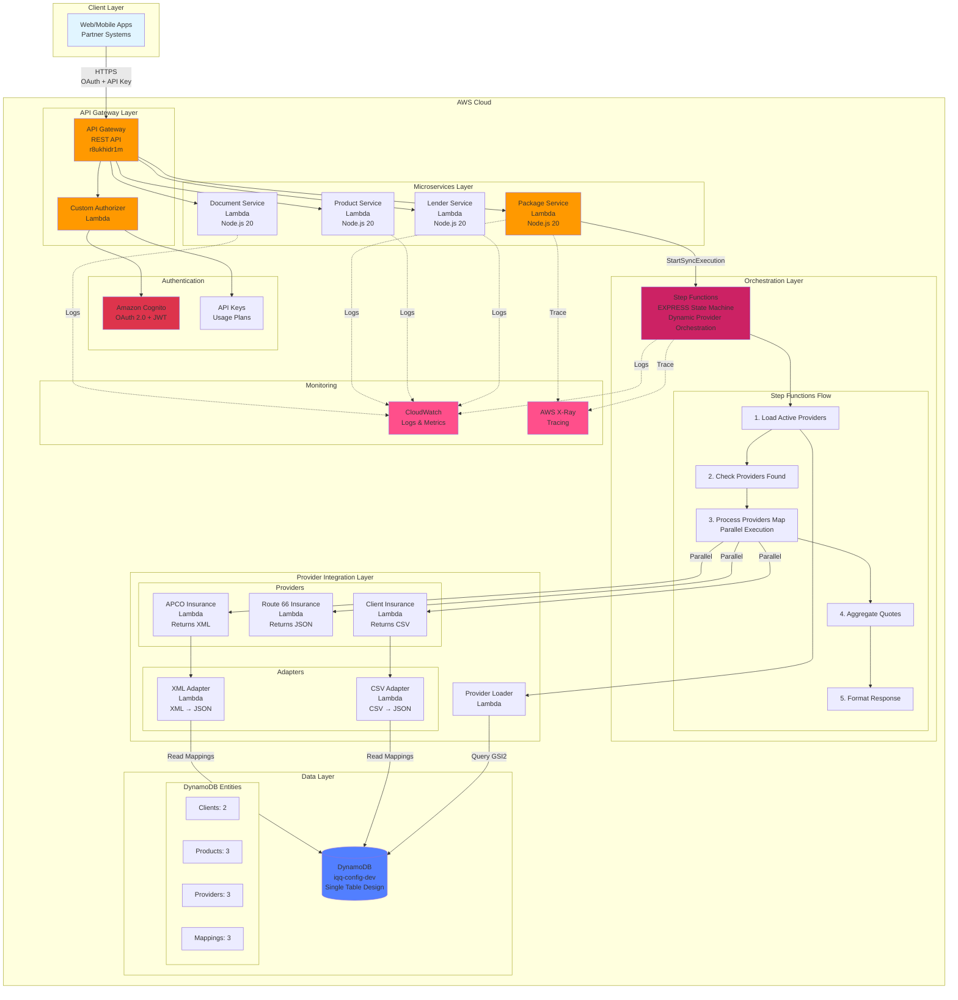
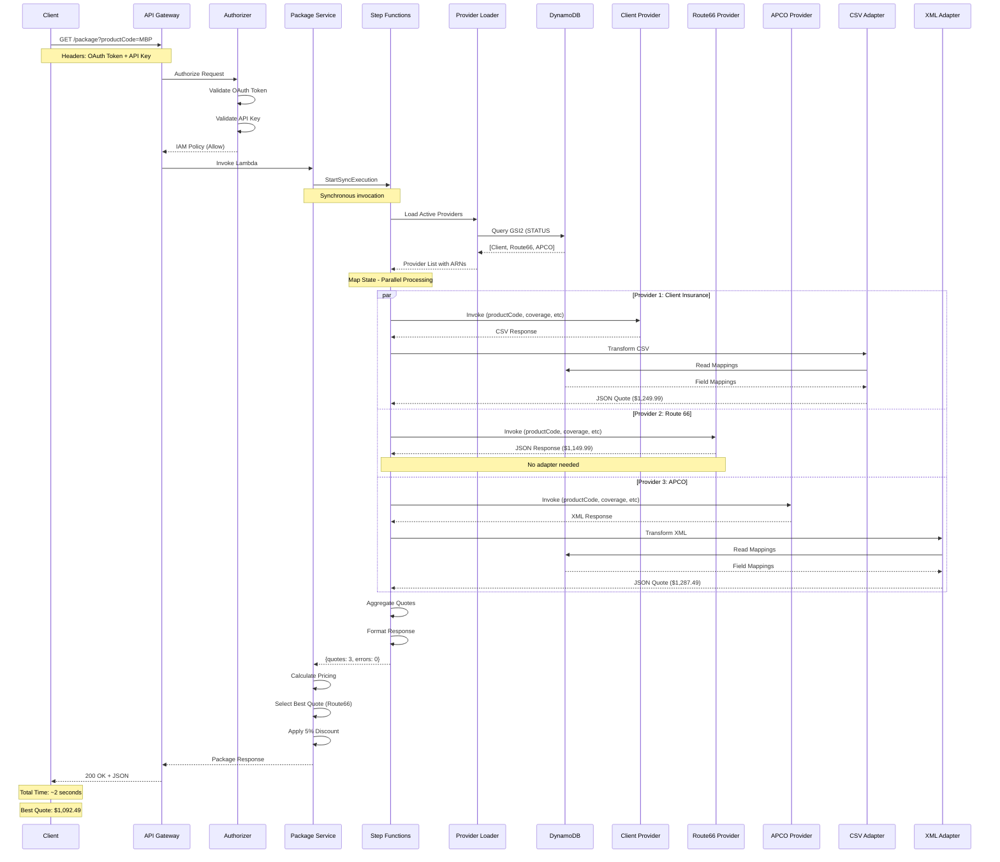
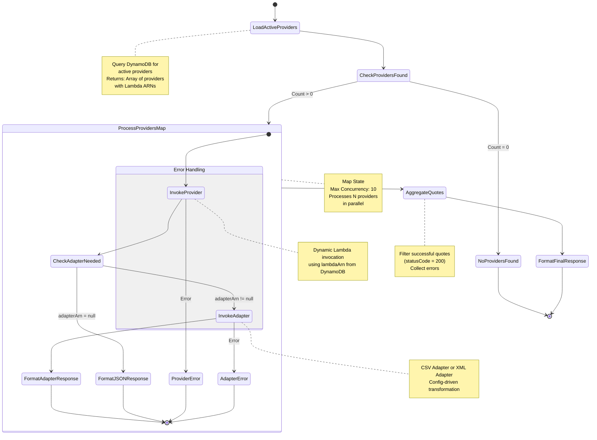
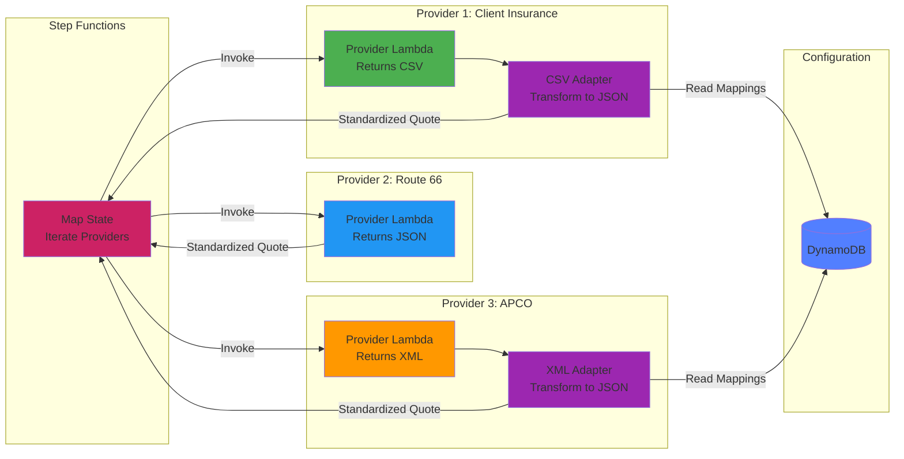
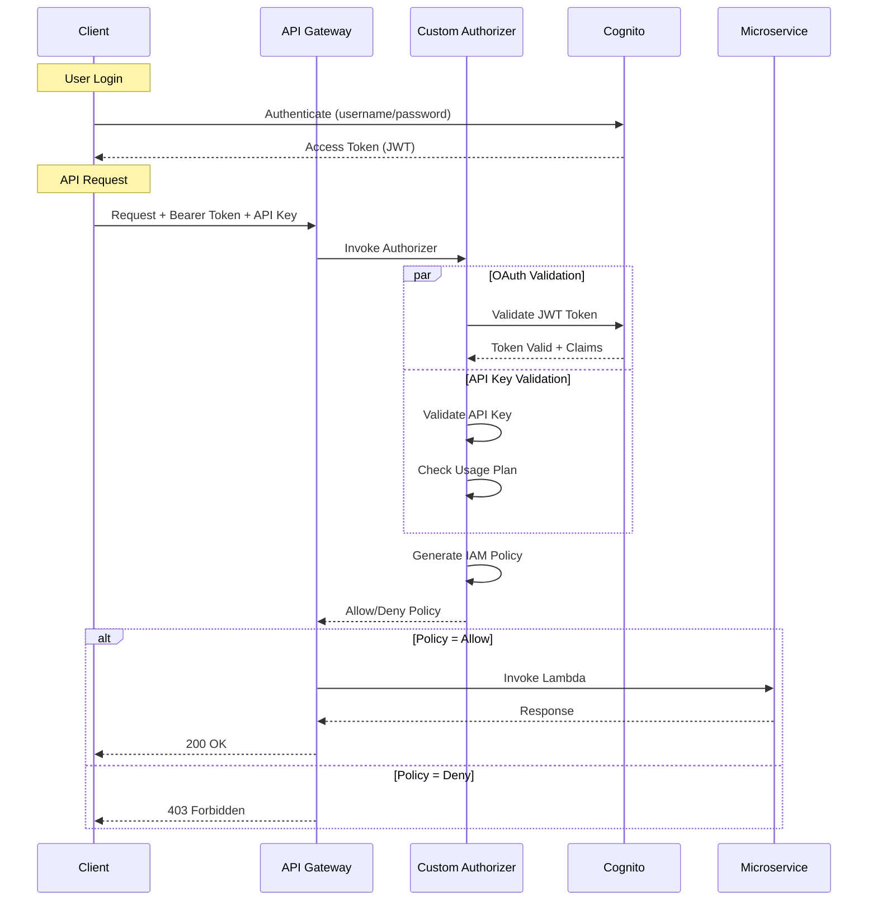
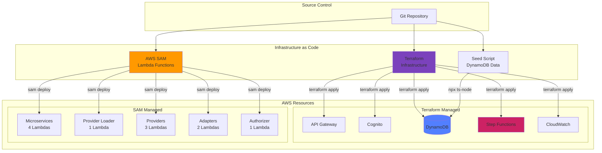
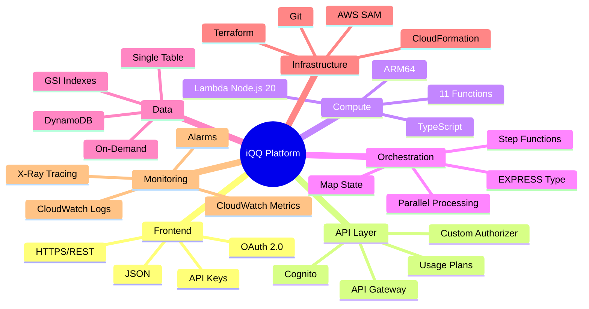
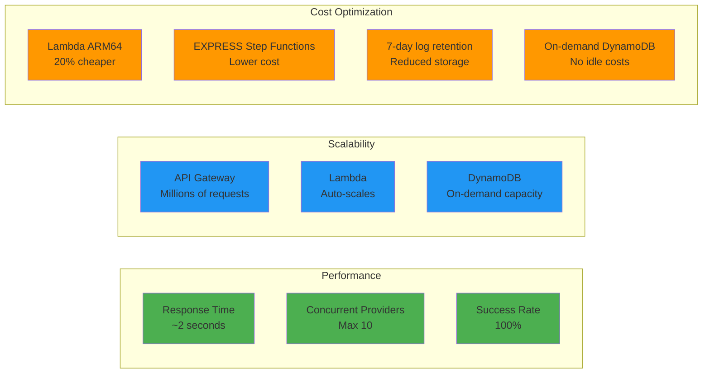

# iQQ Insurance Quoting Platform - Visual Architecture

## System Architecture Overview



## Package Endpoint Request Flow



## Step Functions State Machine Flow



## Data Model - DynamoDB Single Table Design

```mermaid
erDiagram
    CONFIG_TABLE {
        string PK "Partition Key"
        string SK "Sort Key"
        string GSI1PK "Entity Type Index PK"
        string GSI1SK "Entity Type Index SK"
        string GSI2PK "Status Index PK"
        string GSI2SK "Status Index SK"
    }
    
    CLIENT {
        string clientId
        string clientName
        string status
        json contactInfo
        string createdAt
    }
    
    PRODUCT {
        string productId
        string productName
        string productType
        string description
        number basePremium
        string status
    }
    
    PROVIDER {
        string providerId
        string providerName
        string lambdaArn
        string responseFormat
        string adapterArn
        string rating
        string status
        number timeout
    }
    
    MAPPING {
        string productId
        string providerId
        number version
        boolean active
        json mappingConfig
    }
    
    CONFIG_TABLE ||--o{ CLIENT : contains
    CONFIG_TABLE ||--o{ PRODUCT : contains
    CONFIG_TABLE ||--o{ PROVIDER : contains
    CONFIG_TABLE ||--o{ MAPPING : contains
    
    PROVIDER ||--o{ MAPPING : "has mappings"
    PRODUCT ||--o{ MAPPING : "has mappings"
```

## Provider Integration Pattern



## Authentication Flow



## Deployment Architecture



## Technology Stack



## Cost & Performance Metrics



---

## How to View These Diagrams

These diagrams use **Mermaid** syntax and will render automatically in:
- ✅ GitHub
- ✅ GitLab
- ✅ VS Code (with Mermaid extension)
- ✅ Markdown Preview Enhanced
- ✅ Many documentation platforms

For the best viewing experience, open this file in GitHub or use a Mermaid-compatible Markdown viewer.

## Diagram Legend

- **Orange boxes** (#ff9900): AWS Lambda functions
- **Red boxes** (#dd344c): Amazon Cognito
- **Purple boxes** (#cc2264): AWS Step Functions
- **Blue boxes** (#527fff): Amazon DynamoDB
- **Pink boxes** (#ff4f8b): Monitoring services
- **Green boxes** (#4CAF50): Successful operations
- **Blue boxes** (#2196F3): Scalability features
- **Orange boxes** (#FF9800): Cost optimization
